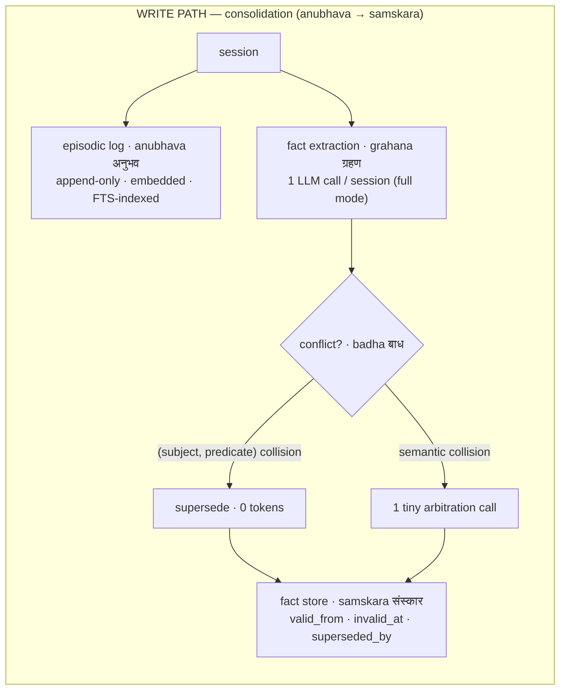
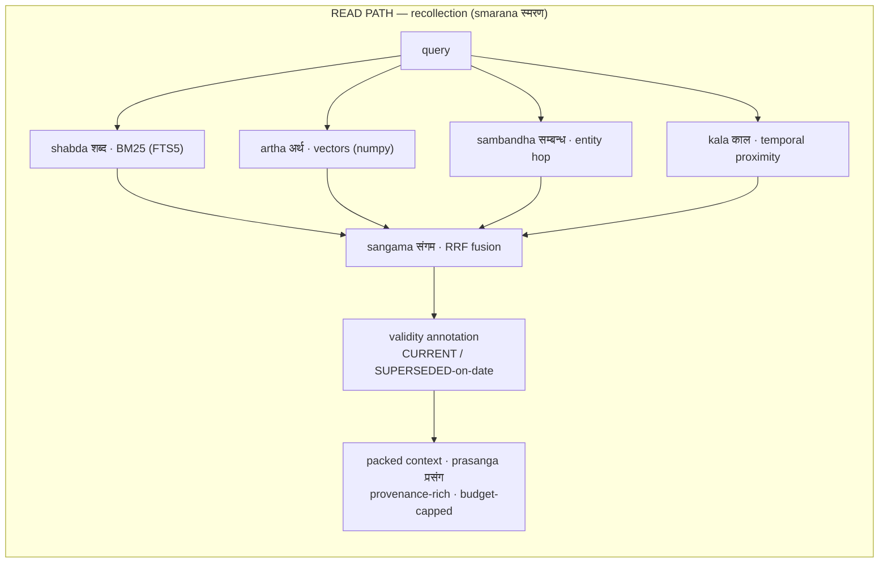

<p align="center">
  
</p>

<h1 align="center">SMRITI <sub>स्मृति</sub></h1>

<p align="center"><b>Structured Memory with Reflective Indexing and Temporal Inference</b><br>
<i>smriti</i> (स्मृति): Sanskrit for "that which is remembered."</p>

<p align="center">
  <a href="LICENSE"></a>
  
  
  
  
  
  <a href="https://github.com/vn-envy/Smriti/pulls"></a>
</p>

A zero-infrastructure, local-first, Apache-2.0 memory layer for AI agents. One SQLite file. No Neo4j, no Postgres, no Docker, no cloud account, no paywalled tiers. Stdlib HTTP + numpy is the entire dependency surface.

```python
from smriti import Smriti, LLM, OllamaEmbedder

mem = Smriti(path="memory.db",
             embedder=OllamaEmbedder("nomic-embed-text"),
             llm=LLM("qwen3:14b", provider="ollama"))

mem.add([{"role": "user", "content": "I moved to Bengaluru on June 1st."}],
        timestamp="2026-06-02T10:00:00Z")

print(mem.context("where do I live?"))
# KNOWN FACTS:
# - [2026-01-15 | SUPERSEDED on 2026-06-01] The user lives in Hyderabad.
# - [2026-06-01 | CURRENT] The user lives in Bengaluru.
```

**Jump to:** [What you get](#what-you-get) · [Agile retrieval](#agile-retrieval-drishti--new-in-020) · [Architecture](#architecture) · [Ancient wisdom, load-bearing](#ancient-wisdom-load-bearing) · [Comparison](#how-it-compares-on-what-youll-actually-run-into) · [Install](#install--try-it-in-60-seconds) · [MCP](#drop-it-into-your-agent-mcp) · [Benchmarks](#benchmarks) · [Roadmap](#roadmap)

## What you get

A memory layer you can run today, on your own machine, and verify on your own data — no infrastructure, no cloud account, no leaderboard to take on faith. Everything below is something we've tested, not marketing copy.

**1. One line to run. Nothing to stand up.** `pip install -e .` gives you a working memory layer in a single SQLite file — no Postgres, Neo4j, Qdrant, Redis, Docker, or cloud account. The dependency surface is the Python standard library plus numpy. The full offline test suite and the quickstart run with no network and no API keys; lite mode is fully offline.

**2. No external services to break — and hardened for real runs.** Memory is one file: no cluster to keep alive or version-match. It's provider-agnostic — point it at any OpenAI-compatible endpoint (Ollama, DeepSeek, Groq, OpenAI, vLLM…) and any embedder. It survives production conditions: automatic retry on transient network errors, fault-tolerant ingest (one bad turn never aborts a run), and progress checkpointing — all added after, and tested against, real network failures.

**3. Cheap to run, by design.** Lite mode does zero LLM calls at write time; full mode does one extraction call per session. Retrieval packs a fixed, budget-capped context (~1,600 tokens per answer in our runs), so per-query cost stays in fractions of a cent — even a frontier reader+judge over 500 questions is ~$2.50. It runs well on small, inexpensive models. Apache-2.0, every feature included — no paid tier for graph, temporal, or scale.

**4. Predictable at scale, and your history never rots.** Measured on the included scaling harness: ~42,000 rows/sec ingest, single-digit-millisecond queries up to ~12k memories, and correct needle retrieval at every scale tested (300k+ rows). Updates *supersede* rather than delete — the old fact is marked past and kept, never destroyed — so accuracy doesn't silently decay as sessions accumulate (the failure mode that degrades delete-on-write systems over time). You can always answer both "what's true now" and "what was true then."

**5. Small enough to read, honest enough to verify yourself.** ~2k readable lines, Apache-2.0. The benchmark harness ships with it, so you measure SMRITI on *your* data, with *your* judge, on *your* hardware — `bench/ab.sh` runs a fixed-judge A/B and prints the delta. We'd rather hand you the tools to prove it than ask you to trust a number we graded ourselves.

## Agile retrieval (*drishti*) — new in 0.2.0

One store, many ways of looking at it. Four retrieval channels — lexical, semantic, entity, temporal — are individually switchable, and **retrieval profiles** bundle them into named, per-query policies. Ask for facts when you want facts; ask for relationships when you want the graph; go deep when you want everything.

| Profile | What it does | Reach for it when |
|---|---|---|
| `facts` | current-state precision: lexical + semantic + 1-hop entity, validity-first, no summaries | "where do I live?", knowledge updates |
| `relations` | 2-hop *sambandha* traversal + semantic entity linking, entity channels up-weighted | "who works with Rachel?", connections |
| `timeline` | *kala*-boosted: date-anchored episodes, chronological evidence, as-of semantics | "what happened in March?", before/after |
| `deep` | all channels + key expansion + observation digests + enumerate-don't-assert packing | counts, totals, "summarize everything" |
| `auto` | zero-token router picks one of the above | agents that don't want to choose |

```python
mem.search("who mentors Rachel?", profile="relations")
mem.context("how many concerts did I attend?", profile="deep")
mem.search("db migration steps", channels={"lexical"})   # BM25 only — skips the embedding entirely
mem.search("what changed in June?", channels={"kala", "artha"})  # Sanskrit aliases accepted

# custom profiles are data, not code — benchmark yours with the shipped harness
from smriti import RetrievalProfile
support = RetrievalProfile(channels={"lexical", "semantic"}, k=8)
mem.search(query, profile=support)
```

> [!NOTE]
> **Others ship knobs. SMRITI ships tuned policies with receipts.** Every built-in profile carries an `evidence` field citing the A/B that justified it (see `smriti/profiles.py` and BENCHMARKS.md — e.g. `deep` is the configuration that lifted multi-session +10.3, McNemar p=0.046, with no knowledge-update regression). The default path without a profile is byte-identical to 0.1.0, so existing evidence still describes existing behavior — and `bench/ab.sh` re-validates any profile, including yours, on your own data.

The same selection is exposed to agents through the MCP tools (`profile` and `channels` on `recall`/`search`), so an agent spends one enum per call instead of seven numeric knobs.

## Architecture





Facts are **never** deleted — supersession preserves the full bi-temporal history (validity window = *avadhi* अवधि), so one store answers both "what's true now" and "what was true then."

Two design decisions worth defending:

1. **Facts AND raw episodes are both first-class at retrieval time.** Extraction-only systems lose whatever the extractor missed; episode-only systems fumble knowledge updates. Fusing both gets the precision of consolidated facts with the recall safety net of raw evidence.
2. **Supersession, not mutation.** "Where do I live?" reads CURRENT facts. "Where did I live before March?" reads the validity windows. Same store, zero extra machinery, full audit trail.

### Modes

- **`lite`** (alias `laghu`, लघु — "light") — no LLM at write time at all. Episodic ingest + 4-channel hybrid retrieval. Near-zero cost, fully offline-capable, and retrieval-only hybrids are known to recover most of the benchmark value. Ideal default for high-volume agents.
- **`full`** (alias `purna`, पूर्ण — "complete") — adds fact extraction + write-time consolidation. One extraction call per session, arbitration calls only on semantic collisions. This is where knowledge-update and temporal-reasoning accuracy comes from.

## Ancient wisdom, load-bearing

SMRITI's vocabulary isn't branding sprinkled on top. Indian epistemology worked out a precise technical language for memory two millennia before vector databases, and the pipeline maps onto it almost one-to-one. Each borrowed term earned its place because the classical meaning *is* the engineering meaning:

- **anubhava → samskara → smriti** (Nyaya): direct experience leaves impressions; recollection arises from impressions. That *is* the write path — and it encodes a design argument: memory is **derived** from experience but is not the experience itself, which is why SMRITI retrieves over both facts (precision) and raw episodes (recall safety net).
- **badha** (बाध, Vedanta — *sublation*): a later cognition invalidates an earlier one **without erasing that it occurred** — as when the rope is seen and the snake is sublated. That is supersession, precisely: `invalid_at` is set, `superseded_by` points forward, history stays queryable. Correction is an event in time, not an overwrite.
- **sangama** (संगम — *confluence*): four rivers meeting. Four retrieval channels, one Reciprocal-Rank-Fusion ranking.
- **drishti** (दृष्टि — *way of seeing*): the same store admits many valid views. Retrieval profiles make each view explicit, named, and testable.
- **mauna** (मौन — *deliberate silence*): knowing when not to answer. Abstention is scored in the harness, not treated as failure.

The rules that keep this honest (full lexicon and reasoning: [`NOMENCLATURE.md`](NOMENCLATURE.md)): **code stays English** (`valid_from`, `retrieve`, `--mode lite` — the two exceptions are the `laghu`/`purna` mode aliases and the channel aliases `shabda`/`artha`/`sambandha`/`kala`); **docs lead with the concept and gloss with the term**; and **no forced poetry** — if a future component has no honest Sanskrit fit, it gets an English name.

<details>
<summary><b>The lexicon at a glance</b> (click to expand)</summary>

| Term | Devanagari | Classical meaning | Maps to |
|---|---|---|---|
| smriti | स्मृति | that which is remembered | the system itself |
| anubhava | अनुभव | direct experience | episodic store (append-only) |
| grahana | ग्रहण | grasping, apprehension | fact extraction |
| samskara | संस्कार | impression left by experience | consolidated fact store |
| badha | बाध | sublation | supersession — invalidate, never delete |
| avadhi | अवधि | term, duration | validity window `[valid_from, invalid_at)` |
| padartha | पदार्थ | entity, category | entity table (graph-lite links) |
| smarana | स्मरण | the act of recollection | retrieval |
| shabda / artha / sambandha / kala | शब्द / अर्थ / सम्बन्ध / काल | word / meaning / relation / time | the four channels |
| sangama | संगम | confluence of rivers | RRF fusion |
| prasanga | प्रसंग | context, occasion | the packed context block |
| drishti | दृष्टि | way of seeing | retrieval profiles |
| laghu / purna | लघु / पूर्ण | light / complete | `lite` / `full` modes |
| pariksha | परीक्षा | examination | the benchmark harness |
| nyaya | न्याय | logic, right judgment | the LLM judge |
| mauna | मौन | deliberate silence | abstention |

</details>

## How it compares on what you'll actually run into

Every recent open framework made a bet, and each bet carries a real operational cost:

| Framework | Their strength | The gap SMRITI closes |
|---|---|---|
| **GBrain** (Garry Tan, Apr 2026) | Self-wiring typed knowledge graph with **zero LLM calls** for extraction; production-proven at 146k+ pages | Requires Postgres + pgvector; you hand-author the markdown skills; no *as-of-date* validity model; coupled to OpenClaw / Hermes |
| **Supermemory** (local build) | Claims #1 on LongMemEval / LoCoMo / ConvoMem; one-binary local mode, RAG + connectors + embedded agent; the mature full-stack option | A large system you trust rather than read; "forgetting" and temporal handling are internal — you can't audit *why* a fact was dropped or which window applied |
| **Mnemosyne** (Hermes ecosystem) | One SQLite file too; binary MIB vectors; encrypted sync; excellent distribution (23 Hermes tools) | Temporal KG is a separate, manual API; `forget`-style ops; knowledge-update is its published weak spot (KU 50.0% on its own BEAM report) — supersession is automatic here, in the main write path |
| mem0 | Mature extraction pipeline, broad SDK, 90k+ devs | Flat fact store loses time; graph features sit behind the $249/mo Pro tier; local self-host wants Docker + Postgres + Qdrant; knowledge updates leave stale facts competing with fresh ones |
| Zep / Graphiti | Bi-temporal knowledge graph — the right *model* for "what was true when" | Heavy graph-database infrastructure; community edition deprecated; advanced features cloud-only |
| Letta / MemGPT | Self-managing memory tiers | You adopt a whole agent runtime, not a library; every memory op costs LLM inference |

SMRITI's synthesis: **keep Zep's temporal model and GBrain's entity graph, drop the database tax; keep mem0's extraction discipline, add supersession; race the leaderboard claims on transparency instead.** One SQLite file, ~2k lines you can read in a sitting, validity windows printed into the context the model sees.

### Bring your own benchmark

SMRITI's stance is **ship-and-verify**. Instead of publishing a self-graded headline, it ships the harness and invites you to generate the only number that matters — on your own conversations, with the model and judge you actually use. Hosted leaders post strong leaderboard scores; those are produced with frontier readers grading their own systems, and (by their own production data) some degrade sharply once stale data and contradictions accumulate at scale. SMRITI's bet is the production reality around the number: run it anywhere, trust what it does, keep your full history, pay almost nothing — and check the accuracy yourself in one command. In our own within-system A/Bs, the per-type router lifts multi-session aggregation ~10 points (p<0.05) with no regression on knowledge-update; whether that holds on your workload is something you confirm, not something we ask you to believe.

## Install & try it in 60 seconds

```bash
pip install -e .              # from this repo
python -m pytest tests/       # 74 offline tests — no network, no API keys
python examples/quickstart.py # see supersession live
```

The quickstart runs fully **offline** (lite mode). For LLM-backed extraction + supersession, point SMRITI at any OpenAI-compatible endpoint (Ollama, vLLM, LM Studio, Groq, DeepSeek, OpenRouter, hosted) and any embedder — nothing else to install.

### Drop it into your agent (MCP)

SMRITI ships a one-command MCP server, so any MCP-compatible agent (Claude Code, Cursor, …) gets persistent, auditable memory:

```bash
smriti-mcp --db memory.db        # or: python -m smriti.mcp_server --db memory.db
```

Add it to your agent's MCP config:

```json
{ "mcpServers": { "smriti": { "command": "smriti-mcp", "args": ["--db", "memory.db"] } } }
```

It exposes six typed tools returning structured JSON — `remember`, `recall`, `search`, `facts_about`, `add_fact`, `stats`. The read tools take `profile` (`facts` / `relations` / `timeline` / `deep` / `auto`) and `channels` arguments, so agents shape retrieval per call. Offline by default (no key); set `SMRITI_LLM_MODEL` / `SMRITI_LLM_PROVIDER` / `SMRITI_API_KEY` for full extraction mode.

### Benchmark it on *your* data

Don't take our word for it — run the included harness on your own conversations, with your own judge:

```bash
bash bench/ab.sh   # fixed-judge A/B, prints the accuracy delta
```

## Benchmarks

The harness ships in `bench/` for **LongMemEval** (ICLR 2025 — the de-facto standard: 500 questions over ~115k-token histories testing extraction, multi-session reasoning, temporal reasoning, knowledge updates, abstention) and **LoCoMo** (the benchmark behind mem0's published numbers).

```bash
# 1. get datasets (LongMemEval from HuggingFace, LoCoMo from GitHub)
python -m bench.download            # oracle + locomo (small, fast)
python -m bench.download --all      # every split, or name one: longmemeval_s

# 2. fast sanity pass on the oracle split, fully local
python -m bench.run --bench longmemeval --data data/longmemeval_oracle.json \
    --mode lite --limit 50 --answer-model qwen3:14b --judge-model qwen3:14b

# 3. the comparable number: full mode on longmemeval_s
python -m bench.run --bench longmemeval --data data/longmemeval_s_cleaned.json \
    --mode full --provider groq --api-key $GROQ_API_KEY \
    --memory-model llama-3.3-70b-versatile \
    --answer-model llama-3.3-70b-versatile --judge-model llama-3.3-70b-versatile

# 4. LoCoMo
python -m bench.run --bench locomo --data data/locomo10.json --mode full --limit 200
```

Output: overall accuracy, **per-question-type accuracy** (the honest view — temporal-reasoning and knowledge-update are where flat stores die), ingest/answer latency, and token counts, plus a full per-question JSONL for error analysis.

> [!IMPORTANT]
> **Honesty section.** SMRITI has not yet been run on the full benchmarks — the harness exists precisely so the numbers come from your hardware, not from marketing. Published reference points to beat or match: Zep ~63.8% and Hindsight ~91.4% on LongMemEval vs. mem0's ~49%; mem0 reports J≈66.9 on LoCoMo. Vendor numbers use different judges, answer models, and splits, so the only comparison that counts is the one you run yourself with a fixed judge. Run lite and full modes side by side; report both. Full results and caveats (including near-significant deltas we refuse to round up): [`BENCHMARKS.md`](BENCHMARKS.md).

## Repo layout

```
smriti/             core library
  store.py          SQLite bi-temporal store — anubhava + samskara (FTS5 + vectors)
  extraction.py     grahana: single-pass session → atomic facts
  consolidation.py  badha: ADD / SUPERSEDE / SKIP conflict resolution
  retrieval.py      smarana: 4-channel retrieval + sangama (RRF) + prasanga packing
  profiles.py       drishti: named, evidence-carrying retrieval profiles + v2 router
  memory.py         public Smriti API (modes: lite/laghu, full/purna)
  embedder.py       Ollama / OpenAI-compatible / offline hash
  llm.py            OpenAI-compatible client + mock
  mcp_server.py     stdlib-only MCP server (6 typed tools, stdio JSON-RPC)
bench/              pariksha: LongMemEval + LoCoMo runners, nyaya judge, CLI, A/B
tests/              offline test suite (mock LLM, hash embedder) — 74 tests
examples/           runnable quickstart
NOMENCLATURE.md     the full lexicon and why each term is load-bearing
site/               the landing page (deployed via Netlify)
```

## Roadmap

### Shipped

Research-driven (Hindsight observation paradigm; StructMem / MemGAS multi-granularity; mem0 entity linking; multi-hop RAG literature), each validated by a fixed-judge A/B:

- [x] Observation/summary layer + additive injection + enumerate-don't-assert
- [x] Multi-granularity digests (per-entity and per-`(subject, predicate)`) + numeric/sum totals
- [x] Recall track — fact-augmented key expansion + aggregation tally path
- [x] **Per-type router** — recall profile for aggregation, precision profile for current-state. Lifts multi-session **+10 pts (p<0.05)** with **no** knowledge-update regression
- [x] mem0-inspired levers — FTS Porter stemmer, semantic entity linking (both opt-in)
- [x] 2-hop entity traversal · cross-encoder reranking · iterative retrieval
- [x] **MCP server** — `smriti-mcp`: stdlib-only stdio JSON-RPC, 6 typed tools, lite-by-default, security-hardened (ATTACH/DETACH authorizer, fixed db path, input caps, crash-proof loop)
- [x] Benchmark harness — stratified `--sample`, `--question-type`, one-command A/B (`bench/ab.sh`)
- [x] **0.2.0 — Agile retrieval (drishti)**: switchable channels, named evidence-carrying profiles (`facts`/`relations`/`timeline`/`deep`), zero-token v2 router, profile-aware MCP tools. Legacy default path byte-identical.
- [x] **0.3.0 — Hardening**: WAL + busy-timeout durability; **idempotent ingestion** (session replay = no-op); **owner-initiated erasure** (`erase_session`/`erase_entity`, full cascade — distinct from supersession, and deliberately *not* exposed via MCP so untrusted content can't trigger it); **entity aliases** (write-time canonicalization + read-time resolution); **lossless export/import** (embeddings included, supersession chains preserved); **opt-in secret redaction** at ingest; unicode lexical search (Devanagari/CJK now reach FTS5); regression suite → 74 offline tests.

### Next priorities (post-ship)

Ordered by impact:

1. **Profile matrix in the harness** — `--profile` flag on `bench/run.py` + per-type × per-profile table; gate any change to the `auto` default on this run.
2. **Numpy vector quantization (int8 / binary + Hamming)** — pure-numpy lift of the O(N) scan ceiling (~10–30× headroom), zero new dependencies; `sqlite-vec` remains the optional ANN tier beyond that. *(Mnemosyne's MIB result, re-derived on our principles)*
3. **LLM-assisted entity canonicalization** — confidence-scored alias *suggestion* on top of 0.3.0's explicit alias layer ("my cousin Rachel" → "rachel"); suggestions only, owner confirms. *(Codebase-Memory resolution cascade + mem0 entity linking)*
4. **`valid_until` at write time** — user-declared expiry as a pre-declared avadhi window; supersession machinery already handles the rest.
5. **Namespaces** — `user_id`/`agent_id` scoping for shared stores. Today's zero-infra answer: one file per agent *is* the namespace (`memory-alice.db`); this item is for teams that outgrow it.
6. **Full `longmemeval_s` + LoCoMo numbers** — publish on the hard (full-haystack) split with a fixed judge; plus a Mnemosyne adapter in `bench/` so the comparison runs same-judge, same-split, same-reader.
7. **Hermes / platform adapters** — `smriti-hermes` + per-platform guides (Claude Code, Cursor, OpenClaw, OpenWebUI).
8. **Further hardening** — embedding-dimension guard, async ingest queue + batched embeddings, schema-version migrations.

### The boundary (how we avoid becoming a 50k-line platform)

The core stays small and auditable; everything else is a replaceable module:

```
core (must stay readable in a sitting)      optional modules (replaceable)
├── episodes (anubhava)                     ├── LLM extraction (any OpenAI-compatible)
├── bi-temporal facts (samskara/badha)      ├── reranking (any .rerank())
├── entity links + aliases (padartha)       ├── observations/reflection (opt-in)
├── 4-channel hybrid retrieval (smarana)    ├── MCP server (stdlib, read/write only)
├── profiles (drishti)                      └── future: remote server/auth,
├── provenance, erasure, export                  multi-agent coordination
└── one SQLite file
```

Reflection, graph traversal beyond 2 hops, dashboards, auth services, and multi-tenant machinery belong *outside* the core — that's the line that keeps SMRITI forkable, auditable, and cheap.

## Contributing

Issues and PRs welcome. The bar for merging a retrieval change is the same bar we hold ourselves to: run `bash bench/ab.sh` (or the offline test suite for non-retrieval changes) and post the delta. Evidence over vibes.

## License

Apache 2.0. Everything. No gated tiers — the temporal model, the entity graph, the retrieval profiles, and the benchmark harness are the product.

## Citation

```bibtex
@software{smriti2026,
  title  = {SMRITI: Structured Memory with Reflective Indexing and Temporal Inference},
  year   = {2026},
  url    = {https://github.com/vn-envy/Smriti},
  note   = {Zero-infrastructure, local-first, bi-temporal memory layer for AI agents}
}
```
