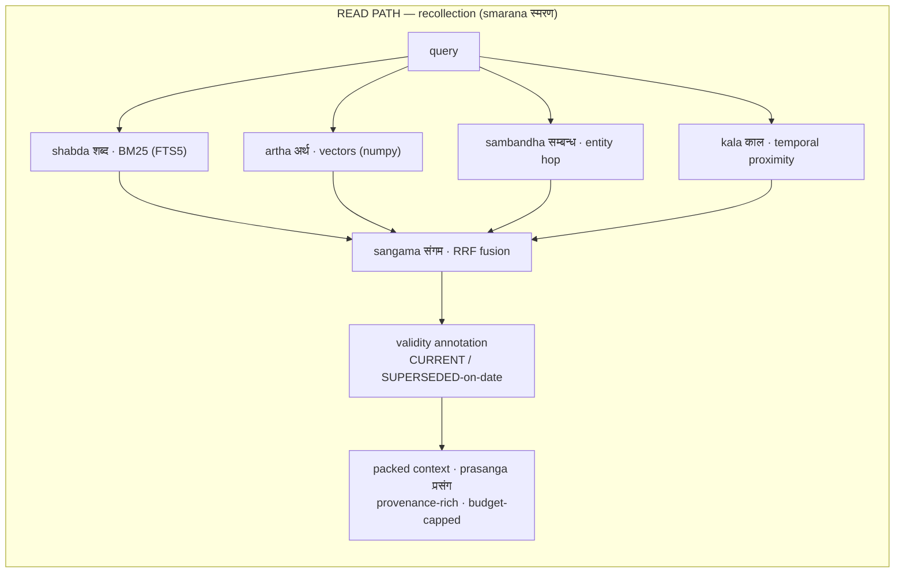

<p align="center">
  
</p>

<h1 align="center">SMRITI <sub>स्मृति</sub></h1>

<p align="center"><b>Structured Memory with Reflective Indexing and Temporal Inference</b><br>
<i>smriti</i> (स्मृति): Sanskrit for "that which is remembered."</p>

<p align="center">
  <a href="LICENSE"></a>
  
  
  
  
  
  <a href="https://github.com/vn-envy/Smriti/pulls"></a>
</p>

<p align="center">
  <a href="https://vn-envy.github.io/Smriti/"><b>smriti.agents.io</b></a> — the four rivers, live
</p>

The core is a zero-infrastructure, local-first, Apache-2.0 memory layer for AI agents. It uses one SQLite file: no Neo4j, Postgres, Docker, cloud account, or paid tier is required. Stdlib HTTP + numpy is the core dependency surface. The optional enterprise package adds governance metadata and can write a separate audit sink or verified pack.

```python
from smriti import Smriti, LLM, OllamaEmbedder

mem = Smriti(path="memory.db",
             embedder=OllamaEmbedder("nomic-embed-text"),
             llm=LLM("qwen3:14b", provider="ollama"))

mem.add([{"role": "user", "content": "I moved to Bengaluru on June 1st."}],
        timestamp="2026-06-02T10:00:00Z")

print(mem.context("where do I live?"))
# KNOWN FACTS:
# - [2026-01-15 | SUPERSEDED on 2026-06-01] The user lives in Hyderabad.
# - [2026-06-01 | CURRENT] The user lives in Bengaluru.
```

**Jump to:** [What you get](#what-you-get) · [Agile retrieval](#agile-retrieval-drishti--new-in-020) · [Architecture](#architecture) · [Ancient wisdom, load-bearing](#ancient-wisdom-load-bearing) · [Comparison](#how-it-compares-on-what-youll-actually-run-into) · [Install](#install--try-it-in-60-seconds) · [MCP](#drop-it-into-your-agent-mcp) · [Benchmarks](#benchmarks) · [Roadmap](#roadmap)

## What you get

A memory layer you can run today, on your own machine, and verify on your own data — no infrastructure, no cloud account, no leaderboard to take on faith. Everything below is something we've tested, not marketing copy.

**1. One line to run. Nothing to stand up.** `pip install -e .` gives you a working core memory layer in a single SQLite file — no Postgres, Neo4j, Qdrant, Redis, Docker, or cloud account. The dependency surface is the Python standard library plus numpy. The offline core suite and quickstart run with no network and no API keys; lite mode is fully offline.

**2. No external services to break — and clear failure boundaries.** Memory is one file: no cluster to keep alive or version-match. It is provider-agnostic — point it at any OpenAI-compatible endpoint (Ollama, DeepSeek, Groq, OpenAI, vLLM…) and any embedder. Direct writes and session ingestion are transactional, identical session replays can be deduplicated, malformed extraction output is diagnosed, and LLM attempt/usage metadata is exposed for inspection.

**3. Cost follows the mode and provider.** Lite mode does zero LLM calls at write time. Full mode makes an extraction call per session and may make additional arbitration calls for semantic conflicts. Provider pricing, model output, retries, and workload determine the bill, so we do not publish a fixed per-question dollar claim. Apache-2.0 includes the graph, temporal, and retrieval-profile features; there is no paid core tier.

**4. A measured local scale envelope, with a clear boundary.** A 256-dim single-run probe reported ~3 ms warm queries at 12.5k rows, ~31 ms at 125k, ~81 ms at 312k, and roughly 50k rows/sec ingest; needle retrieval was correct at each tested checkpoint. These are workload- and hardware-specific observations. The vector channel is an exact numpy scan, so multi-million-row, high-concurrency serving and larger embedding dimensions need further measurement and optional quantization/ANN work. Updates *supersede* rather than delete: prior facts remain queryable with validity metadata, so the store can answer both “what's true now?” and “what was true then?”

**5. Small enough to inspect, honest enough to verify yourself.** The benchmark harness ships with it, so you measure SMRITI on *your* data, with *your* judge, on *your* hardware — `bench/ab.sh` runs a fixed-judge A/B and prints the delta. The audit records the exact configurations and open limits instead of turning a small diagnostic into a leaderboard claim.

## Agile retrieval (*drishti*) — new in 0.2.0

One store, many ways of looking at it. Four retrieval channels — lexical, semantic, entity, temporal — are individually switchable, and **retrieval profiles** bundle them into named, per-query policies. Ask for facts when you want facts; ask for relationships when you want the graph; go deep when you want everything.

| Profile | What it does | Reach for it when |
|---|---|---|
| `facts` | current-state precision: lexical + semantic + 1-hop entity; validity-annotated, CURRENT-facts-first packing; no summaries | "where do I live?", knowledge updates |
| `relations` | 2-hop *sambandha* traversal + semantic entity linking, entity channels up-weighted | "who works with Rachel?", connections |
| `timeline` | *kala*-boosted: date-anchored episodes, chronological evidence, as-of semantics | "what happened in March?", before/after |
| `deep` | all channels + key expansion + observation digests + enumerate-don't-assert packing | counts, totals, "summarize everything" |
| `auto` | zero-token router picks one of the above | agents that don't want to choose |

```python
mem.search("who mentors Rachel?", profile="relations")
mem.context("how many concerts did I attend?", profile="deep")
mem.search("db migration steps", channels={"lexical"})   # BM25 only — skips the embedding entirely
mem.search("what changed in June?", channels={"kala", "artha"})  # Sanskrit aliases accepted

# custom profiles are data, not code — benchmark yours with the shipped harness
from smriti import RetrievalProfile
support = RetrievalProfile(channels={"lexical", "semantic"}, k=8)
mem.search(query, profile=support)
```

> [!NOTE]
> **Others ship knobs. SMRITI ships tuned policies with receipts.** Every built-in profile carries an `evidence` field citing the A/B that justified it (see `smriti/profiles.py` and BENCHMARKS.md — e.g. `deep` is the configuration that lifted multi-session +10.3, McNemar p=0.046, with no knowledge-update regression). The default path without a profile is byte-identical to 0.1.0, so existing evidence still describes existing behavior — and `bench/ab.sh` re-validates any profile, including yours, on your own data.

The same selection is exposed to agents through the MCP tools (`profile` and `channels` on `recall`/`search`), so an agent spends one enum per call instead of seven numeric knobs.

## Architecture




Facts are **never** deleted — supersession preserves the full bi-temporal history (validity window = *avadhi* अवधि), so one store answers both "what's true now" and "what was true then."

Facts may also carry an explicit applicability `scope`, such as
`project:Atlas`. An empty scope is the legacy unscoped value. Only explicitly
single-valued predicates such as `primary_programming_language` and
`preferred_theme` replace an older value within the same subject, predicate,
and scope; generic `prefers` facts remain multi-valued. Scope is persisted and
included in retrieval evidence, MCP structured results, exports, and enterprise
packs. Export format v3 preserves it; v1/v2 imports remain supported under
their existing embedding-identity checks.

Two design decisions worth defending:

1. **Facts AND raw episodes are both first-class at retrieval time.** Extraction-only systems lose whatever the extractor missed; episode-only systems fumble knowledge updates. Fusing both gets the precision of consolidated facts with the recall safety net of raw evidence.
2. **Supersession, not mutation.** "Where do I live?" reads CURRENT facts. "Where did I live before March?" reads the validity windows. Same store, zero extra machinery, full audit trail.

### Modes

- **`lite`** (alias `laghu`, लघु — "light") — no LLM at write time at all. Episodic ingest + 4-channel hybrid retrieval. Fully offline-capable and useful when write-time cost or model access is constrained.
- **`full`** (alias `purna`, पूर्ण — "complete") — adds fact extraction + write-time consolidation. It makes one extraction call per session in the ordinary path, with extra arbitration calls only for semantic collisions. Full-mode quality depends on the configured model and predicate normalization.

## Ancient wisdom, load-bearing

SMRITI's vocabulary isn't branding sprinkled on top. Indian epistemology worked out a precise technical language for memory two millennia before vector databases, and the pipeline maps onto it almost one-to-one. Each borrowed term earned its place because the classical meaning *is* the engineering meaning:

- **anubhava → samskara → smriti** (Nyaya): direct experience leaves impressions; recollection arises from impressions. That *is* the write path — and it encodes a design argument: memory is **derived** from experience but is not the experience itself, which is why SMRITI retrieves over both facts (precision) and raw episodes (recall safety net).
- **badha** (बाध, Vedanta — *sublation*): a later cognition invalidates an earlier one **without erasing that it occurred** — as when the rope is seen and the snake is sublated. That is supersession, precisely: `invalid_at` is set, `superseded_by` points forward, history stays queryable. Correction is an event in time, not an overwrite.
- **sangama** (संगम — *confluence*): four rivers meeting. Four retrieval channels, one Reciprocal-Rank-Fusion ranking.
- **drishti** (दृष्टि — *way of seeing*): the same store admits many valid views. Retrieval profiles make each view explicit, named, and testable.
- **mauna** (मौन — *deliberate silence*): knowing when not to answer. Abstention is scored in the harness, not treated as failure.

The rules that keep this honest (full lexicon and reasoning: [`NOMENCLATURE.md`](NOMENCLATURE.md)): **code stays English** (`valid_from`, `retrieve`, `--mode lite` — the two exceptions are the `laghu`/`purna` mode aliases and the channel aliases `shabda`/`artha`/`sambandha`/`kala`); **docs lead with the concept and gloss with the term**; and **no forced poetry** — if a future component has no honest Sanskrit fit, it gets an English name.

<details>
<summary><b>The lexicon at a glance</b> (click to expand)</summary>

| Term | Devanagari | Classical meaning | Maps to |
|---|---|---|---|
| smriti | स्मृति | that which is remembered | the system itself |
| anubhava | अनुभव | direct experience | episodic store (append-only) |
| grahana | ग्रहण | grasping, apprehension | fact extraction |
| samskara | संस्कार | impression left by experience | consolidated fact store |
| badha | बाध | sublation | supersession — invalidate, never delete |
| avadhi | अवधि | term, duration | validity window `[valid_from, invalid_at)` |
| padartha | पदार्थ | entity, category | entity table (graph-lite links) |
| smarana | स्मरण | the act of recollection | retrieval |
| shabda / artha / sambandha / kala | शब्द / अर्थ / सम्बन्ध / काल | word / meaning / relation / time | the four channels |
| sangama | संगम | confluence of rivers | RRF fusion |
| prasanga | प्रसंग | context, occasion | the packed context block |
| drishti | दृष्टि | way of seeing | retrieval profiles |
| laghu / purna | लघु / पूर्ण | light / complete | `lite` / `full` modes |
| pariksha | परीक्षा | examination | the benchmark harness |
| nyaya | न्याय | logic, right judgment | the LLM judge |
| mauna | मौन | deliberate silence | abstention |

</details>

## How it compares on what you'll actually run into

Every recent open framework made a bet, and each bet carries a real operational cost:

| Framework | Their strength | What Smriti should learn | Defensible distinction |
|---|---|---|---|
| **GBrain** | Typed graph, synthesis and gap analysis, with a local PGLite default and optional Postgres deployments | Operational doctor surfaces, degraded-mode reporting, and query-level evidence | A smaller Python/SQLite kernel focused on inspectable temporal fact history rather than a broad personal/company brain |
| **Graphify** | Deterministic local AST graphs for code, with explicit versus inferred edges | Preserve source locations and make code graphs an optional evidence source | Conversational temporal memory is a different job from code structure |
| **Mem0** | Mature extraction pipeline, broad SDK, managed platform, and multiple local storage options | Mature integrations and fixed-budget, same-judge comparisons | Explicit validity intervals and inspectable history are the focus here; no cross-system superiority is established |
| **Hindsight** | Retain/recall/reflect, observations and Knowledge Pages, with embedded or server deployment | Session synthesis, stale-view refresh, and evidence-delivery checks | A smaller kernel with customer-visible history and optional evidence controls |

SMRITI's position is narrower: preserve explicit temporal history and provenance in a portable SQLite core, while leaving broader graph, synthesis, hosting, and connector surfaces to systems designed for them. Validity windows are printed into the context the model sees, and the comparison harness stays available for workload-specific verification.

### Bring your own benchmark

SMRITI's stance is **ship-and-verify**. The harness lets you measure on your own conversations, with the model and judge you actually use. Within-system oracle A/B evidence reports a +10.3-point multi-session lift for the per-type router (McNemar p=0.046) with no knowledge-update regression in that run; it is not a cross-system result and should be checked on your workload.

## Install & try it in 60 seconds

```bash
git clone https://github.com/vn-envy/Smriti && cd Smriti
python -m pip install -e '.[dev]' # install the core and test tools from source
python -m pytest tests/ -q    # core tests — no network, no API keys
python examples/quickstart.py # see supersession live
```

> [!WARNING]
> The package metadata uses **`smriti-agents`** (the `smriti-memory` name belongs to an unrelated project). No PyPI release was verified for this snapshot, so install from the repository as above. The import name is `smriti`.

The quickstart runs fully **offline** using `MockLLM` to demonstrate full-mode extraction and supersession. For real LLM-backed extraction, point SMRITI at any OpenAI-compatible endpoint (Ollama, vLLM, LM Studio, Groq, DeepSeek, OpenRouter, hosted) and any embedder — nothing else to install.

For an existing database, `smriti-doctor --db memory.db` performs read-only SQLite integrity, schema, count, WAL, and embedding-dimension checks. The command reports whether embedder identity is tracked, legacy-untracked, or empty-untracked.

SMRITI records the embedder identity in each new database and rejects a reopen with an incompatible model, endpoint, or dimension. Databases created before this metadata existed require a one-time explicit `Smriti(..., adopt_legacy_embedder=True)` after you verify that the configured embedder matches the one originally used. For MCP-managed databases, use `smriti-mcp --adopt-legacy-embedder --db memory.db` for that one-time adoption.

Core `export_json()` / `import_json()` is lossless for the core schema, including embeddings and supersession chains. Enterprise governance metadata is outside that format: use `enterprise_mem.snapshot(path)` for a consistent database backup, or `enterprise_mem.build_pack(path, name=...)` followed by `verify_pack()` / `open_pack()` for a checksummed, optionally signed, read-only knowledge pack. Do not use core JSON export as an enterprise governance backup.

### Drop it into your agent (MCP)

SMRITI ships a one-command MCP server, so any MCP-compatible agent (Claude Code, Cursor, …) gets persistent, auditable memory:

```bash
smriti-mcp --db memory.db        # or: python -m smriti.mcp_server --db memory.db
```

Add it to your agent's MCP config:

```json
{ "mcpServers": { "smriti": { "command": "smriti-mcp", "args": ["--db", "memory.db"] } } }
```

It exposes six typed tools returning structured JSON — `remember`, `recall`, `search`, `facts_about`, `add_fact`, `stats`. The read tools take `profile` (`facts` / `relations` / `timeline` / `deep` / `auto`) and `channels` arguments, so agents shape retrieval per call. Offline by default (no key); set `SMRITI_LLM_MODEL` / `SMRITI_LLM_PROVIDER` / `SMRITI_API_KEY` for full extraction mode.

### Benchmark it on *your* data

Don't take our word for it — run the included harness on your own conversations, with your own judge:

```bash
bash bench/ab.sh   # fixed-judge A/B, prints the accuracy delta
```

## Benchmarks

The harness ships in `bench/` for **LongMemEval** (ICLR 2025 — the de-facto standard: 500 questions over ~115k-token histories testing extraction, multi-session reasoning, temporal reasoning, knowledge updates, abstention) and **LoCoMo** (the benchmark behind mem0's published numbers).

```bash
# 1. get datasets (LongMemEval from HuggingFace, LoCoMo from GitHub)
python -m bench.download            # oracle + locomo (small, fast)
python -m bench.download --all      # every split, or name one: longmemeval_s

# 2. evidence-only sanity pass on the oracle split, fully local
python -m bench.run --bench longmemeval --data data/longmemeval_oracle.json \
    --mode lite --limit 50 --answer-model qwen3:14b --judge-model qwen3:14b

# 3. the comparable number: full mode on longmemeval_s
python -m bench.run --bench longmemeval --data data/longmemeval_s_cleaned.json \
    --mode full --provider groq --api-key $GROQ_API_KEY \
    --memory-model llama-3.3-70b-versatile \
    --answer-model llama-3.3-70b-versatile --judge-model llama-3.3-70b-versatile

# 4. LoCoMo
python -m bench.run --bench locomo --data data/locomo10.json --mode full --limit 200
```

Output: overall accuracy, **per-question-type accuracy** (the honest view — temporal-reasoning and knowledge-update are where flat stores die), ingest/answer latency, and token counts, plus a full per-question JSONL for error analysis.

> [!IMPORTANT]
> **Honesty section.** The current evidence includes a 500-question LongMemEval **oracle, evidence-only retrieval** run (extraction and answer generation bypassed), plus a 20-document/12-query diagnostic across Smriti, Mem0, GBrain, and a lexical control. These are useful checks, not full-haystack answer quality or a universal ranking. A separate persistent GBrain lexical growth run covers 100 and 1,000 documents, but uses no embeddings and does not establish parity with Smriti or Mem0 ([raw run](audit/2026-09-05/raw/independent-gbrain-growth.json)). Full `longmemeval_s` / LoCoMo runs with one shared answer and judge configuration, and a matched cost/speed growth comparison, remain unfinished. See [`BENCHMARKS.md`](BENCHMARKS.md), the [benchmark methodology audit](audit/2026-09-05/benchmark-methodology.md), and the [verified results](audit/2026-09-05/VERIFIED-RESULTS.md).

## Repo layout

```
smriti/             core library
  store.py          SQLite bi-temporal store — anubhava + samskara (FTS5 + vectors)
  extraction.py     grahana: single-pass session → atomic facts
  consolidation.py  badha: ADD / SUPERSEDE / SKIP conflict resolution
  retrieval.py      smarana: 4-channel retrieval + sangama (RRF) + prasanga packing
  profiles.py       drishti: named, evidence-carrying retrieval profiles + v2 router
  memory.py         public Smriti API (modes: lite/laghu, full/purna)
  embedder.py       Ollama / OpenAI-compatible / offline hash
  llm.py            OpenAI-compatible client + mock
  mcp_server.py     stdlib-only MCP server (6 typed tools, stdio JSON-RPC)
bench/              pariksha: LongMemEval + LoCoMo runners, nyaya judge, CLI, A/B
tests/              core offline test suite (mock LLM, hash embedder)
examples/           runnable quickstart
NOMENCLATURE.md     the full lexicon and why each term is load-bearing
enterprise/         optional enterprise modules (separate package, zero core edits):
                    tri-temporal as-of queries · exact lineage · evidence receipts
                    · retention/legal holds · deployment profiles · verified
                    knowledge packs · multi-store federation. See enterprise/README.md
site/               the landing page — live at smriti-memory.netlify.app
```

## Roadmap

### Current candidate (verified 2026-09-07)

- [x] Core and enterprise package installs pass **169 tests** across non-editable wheels on macOS Python 3.11 and Linux Python 3.12, plus an isolated Linux Python 3.9 source-distribution install. See [`audit/2026-09-05/VERIFIED-RESULTS.md`](audit/2026-09-05/VERIFIED-RESULTS.md).
- [x] Temporal hardening: late-arriving facts rebuild validity chains in event-time order; enterprise world-time and system-known-time queries preserve the expected boundary.
- [x] Extraction diagnostics and embedder identity metadata: malformed or rejected extraction output is reported, and incompatible vector spaces fail before reads or writes mix. Legacy databases require explicit adoption after operator verification.
- [x] Read-only `smriti-doctor`, atomic export/restore for the core schema, MCP structured results, and lifecycle support.
- [x] Exactly 30 seconds of rendered launch video plus a browser preview that reported `WEBGPU · ACTIVE` in Chrome; see [`audit/2026-09-05/video.md`](audit/2026-09-05/video.md).

### Next priorities

Ordered by impact:

1. **Finish reproducibility documentation and measurements** — complete the full-history LongMemEval/LoCoMo track with pinned data, identical reader/judge settings, failure-inclusive denominators, and raw per-question outputs. Keep the existing oracle and 20-document diagnostic clearly labeled as such.
2. **Finish matched growth and cost reporting** — rerun multiple corpus checkpoints with effective embedding parity and explicit process boundaries. Do not publish speed ratios from the current artifacts: the GBrain run has one checkpoint and CLI startup, and the Mem0/Smriti filenames do not establish parity.
3. **Finish operator documentation** — exercise source and non-editable installs, `smriti-doctor`, embedder legacy adoption, core JSON export, and the enterprise snapshot/knowledge-pack boundary in a clean environment.
4. **Validate full-mode extraction on representative models** — keep extraction status, accepted/skipped counts, predicate normalization, and semantic-arbitration outcomes visible in the evidence; do not treat the scripted quickstart as model-quality proof.
5. **Only then evaluate architecture work** — profile matrices, higher-dimensional/concurrent scaling, optional quantization/ANN, richer graph edges, namespaces, and platform adapters should each follow workload evidence and retain an exact-search regression oracle.

### The boundary (how we avoid becoming a 50k-line platform)

The core stays small and auditable; everything else is a replaceable module:

```
core (must stay readable in a sitting)      optional modules (replaceable)
├── episodes (anubhava)                     ├── LLM extraction (any OpenAI-compatible)
├── bi-temporal facts (samskara/badha)      ├── reranking (any .rerank())
├── entity links + aliases (padartha)       ├── observations/reflection (opt-in)
├── 4-channel hybrid retrieval (smarana)    ├── MCP server (stdlib, read/write only)
├── profiles (drishti)                      └── future: remote server/auth,
├── provenance, erasure, export                  multi-agent coordination
└── one SQLite file
```

Reflection, graph traversal beyond 2 hops, dashboards, auth services, and multi-tenant machinery belong *outside* the core — that's the line that keeps SMRITI forkable, auditable, and cheap.

## Contributing

Issues and PRs welcome. The bar for merging a retrieval change is the same bar we hold ourselves to: run `bash bench/ab.sh` (or the offline test suite for non-retrieval changes) and post the delta. Evidence over vibes.

## License

Apache 2.0. Everything. No gated tiers — the temporal model, the entity graph, the retrieval profiles, and the benchmark harness are the product.

## Citation

```bibtex
@software{smriti2026,
  title  = {SMRITI: Structured Memory with Reflective Indexing and Temporal Inference},
  year   = {2026},
  url    = {https://github.com/vn-envy/Smriti},
  note   = {Zero-infrastructure, local-first, bi-temporal memory layer for AI agents}
}
```
