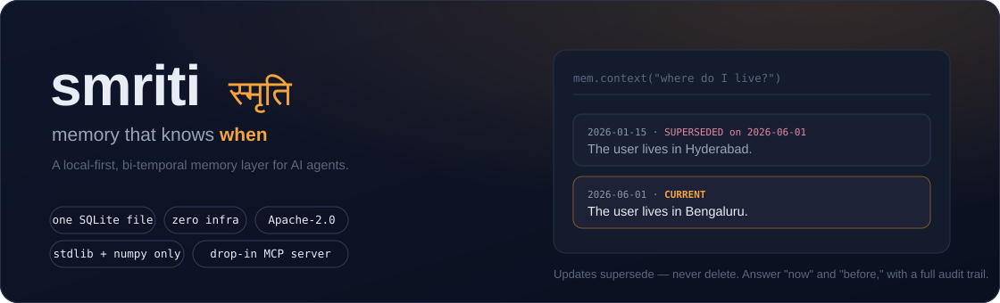

# SMRITI

<p align="center">
  
</p>

**Structured Memory with Reflective Indexing and Temporal Inference**

*smriti* (स्मृति): Sanskrit for "that which is remembered."

A zero-infrastructure, local-first, Apache-2.0 memory layer for AI agents. One SQLite file. No Neo4j, no Postgres, no Docker, no cloud account, no paywalled tiers. Stdlib HTTP + numpy is the entire dependency surface.

```python
from smriti import Smriti, LLM, OllamaEmbedder

mem = Smriti(path="memory.db",
             embedder=OllamaEmbedder("nomic-embed-text"),
             llm=LLM("qwen3:14b", provider="ollama"))

mem.add([{"role": "user", "content": "I moved to Bengaluru on June 1st."}],
        timestamp="2026-06-02T10:00:00Z")

print(mem.context("where do I live?"))
# KNOWN FACTS:
# - [2026-01-15 | SUPERSEDED on 2026-06-01] The user lives in Hyderabad.
# - [2026-06-01 | CURRENT] The user lives in Bengaluru.
```

## What you get

A memory layer you can run today, on your own machine, and verify on your own data — no infrastructure, no cloud account, no leaderboard to take on faith. Everything below is something we've tested, not marketing copy.

**1. One line to run. Nothing to stand up.** `pip install -e .` gives you a working memory layer in a single SQLite file — no Postgres, Neo4j, Qdrant, Redis, Docker, or cloud account. The dependency surface is the Python standard library plus numpy. The full offline test suite and the quickstart run with no network and no API keys; lite mode is fully offline.

**2. No external services to break — and hardened for real runs.** Memory is one file: no cluster to keep alive or version-match. It's provider-agnostic — point it at any OpenAI-compatible endpoint (Ollama, DeepSeek, Groq, OpenAI, vLLM…) and any embedder. It survives production conditions: automatic retry on transient network errors, fault-tolerant ingest (one bad turn never aborts a run), and progress checkpointing — all added after, and tested against, real network failures.

**3. Cheap to run, by design.** Lite mode does zero LLM calls at write time; full mode does one extraction call per session. Retrieval packs a fixed, budget-capped context (~1,600 tokens per answer in our runs), so per-query cost stays in fractions of a cent — even a frontier reader+judge over 500 questions is ~$2.50. It runs well on small, inexpensive models. Apache-2.0, every feature included — no paid tier for graph, temporal, or scale.

**4. Predictable at scale, and your history never rots.** Measured on the included scaling harness: ~42,000 rows/sec ingest, single-digit-millisecond queries up to ~12k memories, and correct needle retrieval at every scale tested (300k+ rows). Updates *supersede* rather than delete — the old fact is marked past and kept, never destroyed — so accuracy doesn't silently decay as sessions accumulate (the failure mode that degrades delete-on-write systems over time). You can always answer both "what's true now" and "what was true then."

**5. Small enough to read, honest enough to verify yourself.** ~1.5k readable lines, Apache-2.0. The benchmark harness ships with it, so you measure SMRITI on *your* data, with *your* judge, on *your* hardware — `bench/ab.sh` runs a fixed-judge A/B and prints the delta. We'd rather hand you the tools to prove it than ask you to trust a number we graded ourselves.

## How it compares on what you'll actually run into

Every recent open framework made a bet, and each bet carries a real operational cost:

| Framework | Their strength | The gap SMRITI closes |
|---|---|---|
| **GBrain** (Garry Tan, Apr 2026) | Self-wiring typed knowledge graph with **zero LLM calls** for extraction; production-proven at 146k+ pages | Requires Postgres + pgvector; you hand-author the markdown skills; no *as-of-date* validity model; coupled to OpenClaw / Hermes |
| **Supermemory** (local build) | Claims #1 on LongMemEval / LoCoMo / ConvoMem; one-binary local mode, RAG + connectors + embedded agent; the mature full-stack option | A large system you trust rather than read; "forgetting" and temporal handling are internal — you can't audit *why* a fact was dropped or which window applied |
| mem0 | Mature extraction pipeline, broad SDK, 90k+ devs | Flat fact store loses time; graph features sit behind the $249/mo Pro tier; local self-host wants Docker + Postgres + Qdrant; knowledge updates leave stale facts competing with fresh ones |
| Zep / Graphiti | Bi-temporal knowledge graph — the right *model* for "what was true when" | Heavy graph-database infrastructure; community edition deprecated; advanced features cloud-only |
| Letta / MemGPT | Self-managing memory tiers | You adopt a whole agent runtime, not a library; every memory op costs LLM inference |

SMRITI's synthesis: **keep Zep's temporal model and GBrain's entity graph, drop the database tax; keep mem0's extraction discipline, add supersession; race Supermemory on transparency rather than on a leaderboard.** One SQLite file, ~1.5k lines you can read in a sitting, validity windows printed into the context the model sees.

### Bring your own benchmark

SMRITI's stance is **ship-and-verify**. Instead of publishing a self-graded headline, it ships the harness and invites you to generate the only number that matters — on your own conversations, with the model and judge you actually use. Hosted leaders post strong leaderboard scores; those are produced with frontier readers grading their own systems, and (by their own production data) some degrade sharply once stale data and contradictions accumulate at scale. SMRITI's bet is the production reality around the number: run it anywhere, trust what it does, keep your full history, pay almost nothing — and check the accuracy yourself in one command. In our own within-system A/Bs, the per-type router lifts multi-session aggregation ~10 points (p<0.05) with no regression on knowledge-update; whether that holds on your workload is something you confirm, not something we ask you to believe.

## Architecture

Each stage carries its Sanskrit name — not branding, but borrowed precision. The Nyaya account of memory (**anubhava → samskara → smriti**: experience leaves impressions, recollection arises from impressions) *is* the write path; Vedanta's **badha** (sublation: a later cognition invalidates an earlier one without erasing that it occurred) *is* supersession. Full lexicon and the reasoning behind each term: [`NOMENCLATURE.md`](NOMENCLATURE.md).

```
WRITE PATH (consolidation at write time)
  session ──► episodic log · anubhava अनुभव  (append-only, embedded, FTS-indexed)
          └─► fact extraction · grahana ग्रहण  (1 LLM call / session)
                └─► conflict resolution · badha बाध :
                      tier 1: (subject, predicate) key collision  → supersede, 0 tokens
                      tier 2: semantic collision → 1 tiny arbitration call
                    facts are NEVER deleted — invalid_at + superseded_by
                    preserve full bi-temporal history (validity window = avadhi अवधि)
                fact store · samskara संस्कार

READ PATH (reflection at read time) · smarana स्मरण
  query ──► 4 channels in parallel:
              1. shabda  शब्द    BM25 (SQLite FTS5)        over facts + episodes
              2. artha   अर्थ    vectors                    over facts + episodes
              3. sambandha सम्बन्ध entity hop (graph-lite, padartha पदार्थ links)
              4. kala    काल    episodes nearest to dates in the query
        ──► Reciprocal Rank Fusion · sangama संगम
        ──► validity annotation (CURRENT / SUPERSEDED-on-date)
        ──► packed, provenance-rich context · prasanga प्रसंग
```

Two design decisions worth defending:

1. **Facts AND raw episodes are both first-class at retrieval time.** Extraction-only systems lose whatever the extractor missed; episode-only systems fumble knowledge updates. Fusing both gets the precision of consolidated facts with the recall safety net of raw evidence.
2. **Supersession, not mutation.** "Where do I live?" reads CURRENT facts. "Where did I live before March?" reads the validity windows. Same store, zero extra machinery, full audit trail.

### Modes

- **`lite`** (alias `laghu`, लघु — "light") — no LLM at write time at all. Episodic ingest + 4-channel hybrid retrieval. Near-zero cost, fully offline-capable, and retrieval-only hybrids are known to recover most of the benchmark value. Ideal default for high-volume agents.
- **`full`** (alias `purna`, पूर्ण — "complete") — adds fact extraction + write-time consolidation. One extraction call per session, arbitration calls only on semantic collisions. This is where knowledge-update and temporal-reasoning accuracy comes from.

## Install & try it in 60 seconds

```bash
pip install -e .              # from this repo
python -m pytest tests/       # 33 offline tests — no network, no API keys
python examples/quickstart.py # see supersession live
```

The quickstart runs fully **offline** (lite mode). For LLM-backed extraction + supersession, point SMRITI at any OpenAI-compatible endpoint (Ollama, vLLM, LM Studio, Groq, DeepSeek, OpenRouter, hosted) and any embedder — nothing else to install.

### Drop it into your agent (MCP)

SMRITI ships a one-command MCP server, so any MCP-compatible agent (Claude Code, Cursor, …) gets persistent, auditable memory:

```bash
smriti-mcp --db memory.db        # or: python -m smriti.mcp_server --db memory.db
```

Add it to your agent's MCP config:

```json
{ "mcpServers": { "smriti": { "command": "smriti-mcp", "args": ["--db", "memory.db"] } } }
```

It exposes six typed tools returning structured JSON — `remember`, `recall`, `search`, `facts_about`, `add_fact`, `stats`. Offline by default (no key); set `SMRITI_LLM_MODEL` / `SMRITI_LLM_PROVIDER` / `SMRITI_API_KEY` for full extraction mode.

### Benchmark it on *your* data

Don't take our word for it — run the included harness on your own conversations, with your own judge:

```bash
bash bench/ab.sh   # fixed-judge A/B, prints the accuracy delta
```

## Benchmarks

The harness ships in `bench/` for **LongMemEval** (ICLR 2025 — the de-facto standard: 500 questions over ~115k-token histories testing extraction, multi-session reasoning, temporal reasoning, knowledge updates, abstention) and **LoCoMo** (the benchmark behind mem0's published numbers).

```bash
# 1. get datasets (LongMemEval from HuggingFace, LoCoMo from GitHub)
python -m bench.download            # oracle + locomo (small, fast)
python -m bench.download --all      # every split, or name one: longmemeval_s

# 2. fast sanity pass on the oracle split, fully local
python -m bench.run --bench longmemeval --data data/longmemeval_oracle.json \
    --mode lite --limit 50 --answer-model qwen3:14b --judge-model qwen3:14b

# 3. the comparable number: full mode on longmemeval_s
python -m bench.run --bench longmemeval --data data/longmemeval_s_cleaned.json \
    --mode full --provider groq --api-key $GROQ_API_KEY \
    --memory-model llama-3.3-70b-versatile \
    --answer-model llama-3.3-70b-versatile --judge-model llama-3.3-70b-versatile

# 4. LoCoMo
python -m bench.run --bench locomo --data data/locomo10.json --mode full --limit 200
```

Output: overall accuracy, **per-question-type accuracy** (the honest view — temporal-reasoning and knowledge-update are where flat stores die), ingest/answer latency, and token counts, plus a full per-question JSONL for error analysis.

**Honesty section.** SMRITI has not yet been run on the full benchmarks — the harness exists precisely so the numbers come from your hardware, not from marketing. Published reference points to beat or match: Zep ~63.8% and Hindsight ~91.4% on LongMemEval vs. mem0's ~49%; mem0 reports J≈66.9 on LoCoMo. Vendor numbers use different judges, answer models, and splits, so the only comparison that counts is the one you run yourself with a fixed judge. Run lite and full modes side by side; report both.

## Repo layout

```
smriti/             core library
  store.py          SQLite bi-temporal store — anubhava + samskara (FTS5 + vectors)
  extraction.py     grahana: single-pass session → atomic facts
  consolidation.py  badha: ADD / SUPERSEDE / SKIP conflict resolution
  retrieval.py      smarana: 4-channel retrieval + sangama (RRF) + prasanga packing
  memory.py         public Smriti API (modes: lite/laghu, full/purna)
  embedder.py       Ollama / OpenAI-compatible / offline hash
  llm.py            OpenAI-compatible client + mock
  mcp_server.py     stdlib-only MCP server (6 typed tools, stdio JSON-RPC)
bench/              pariksha: LongMemEval + LoCoMo runners, nyaya judge, CLI, A/B
tests/              offline test suite (mock LLM, hash embedder) — 33 tests
examples/           runnable quickstart
NOMENCLATURE.md     the full lexicon and why each term is load-bearing
smriti-dashboard.html  feature-level comparison dashboard (open in any browser)
smriti-landing.html    three.js landing page — the four rivers of sangama (vendor/three.min.js fallback included, works offline)
smriti-teaser.html     36-second self-contained launch teaser — open, it plays and loops; screen-record at 1080p or share the link
```

## Roadmap

### Shipped

Research-driven (Hindsight observation paradigm; StructMem / MemGAS multi-granularity; mem0 entity linking; multi-hop RAG literature), each validated by a fixed-judge A/B:

- [x] Observation/summary layer + additive injection + enumerate-don't-assert
- [x] Multi-granularity digests (per-entity and per-`(subject, predicate)`) + numeric/sum totals
- [x] Recall track — fact-augmented key expansion + aggregation tally path
- [x] **Per-type router** — recall profile for aggregation, precision profile for current-state. Lifts multi-session **+10 pts (p<0.05)** with **no** knowledge-update regression
- [x] mem0-inspired levers — FTS Porter stemmer, semantic entity linking (both opt-in)
- [x] 2-hop entity traversal · cross-encoder reranking · iterative retrieval
- [x] **MCP server** — `smriti-mcp`: stdlib-only stdio JSON-RPC, 6 typed tools, lite-by-default, security-hardened (ATTACH/DETACH authorizer, fixed db path, input caps, crash-proof loop)
- [x] Benchmark harness — stratified `--sample`, `--question-type`, one-command A/B (`bench/ab.sh`)

### Next priorities (post-ship)

Deferred until after release; ordered by impact:

1. **Entity canonicalization** — confidence-scored alias merge at write time ("Rachel" / "my cousin Rachel" / "Rachel Smith" → one entity). Closes the fragmentation behind cross-entity aggregation. *(Codebase-Memory resolution cascade + mem0 entity linking)*
2. **`sqlite-vec` ANN backend** — optional vector index to lift the O(N) scan past ~100k rows; falls back to numpy, keeps the single-file zero-infra default. *(the measured scaling ceiling)*
3. **Full `longmemeval_s` + LoCoMo numbers** — publish on the hard (full-haystack) split with a fixed judge; optionally a frontier reader for leaderboard comparability (~$2.50/run, see BENCHMARKS.md).
4. **Recursive-CTE N-hop traversal** — arbitrary-depth entity traversal in pure SQL. *(Codebase-Memory technique)*
5. **Incremental observation refresh** — content-hash so only changed entities/predicates re-summarize. *(XXH3 pattern)*
6. **Production hardening** — embedding-dimension guard, async ingest queue + batched embeddings, multi-user (`user_id`) namespacing, concurrency-safe store.

## License

Apache 2.0. Everything. No gated tiers — the temporal model, the entity graph, and the benchmark harness are the product.
