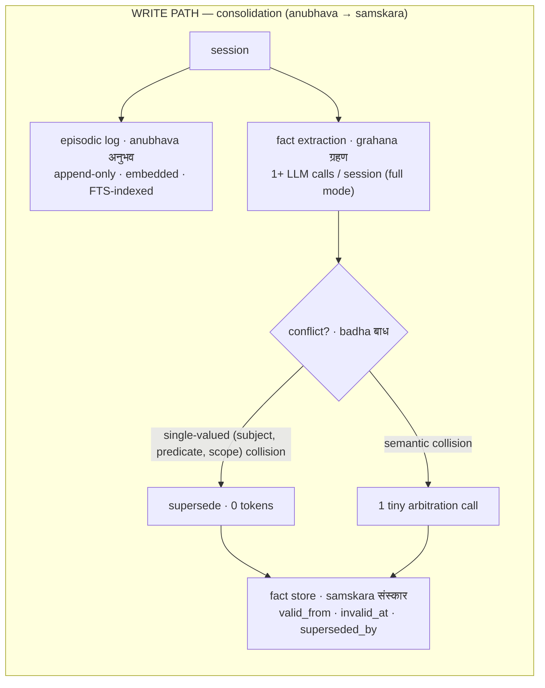
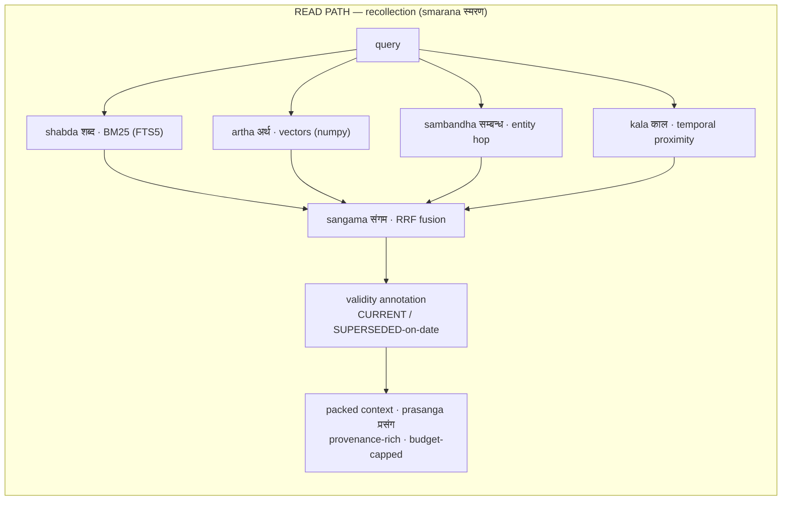
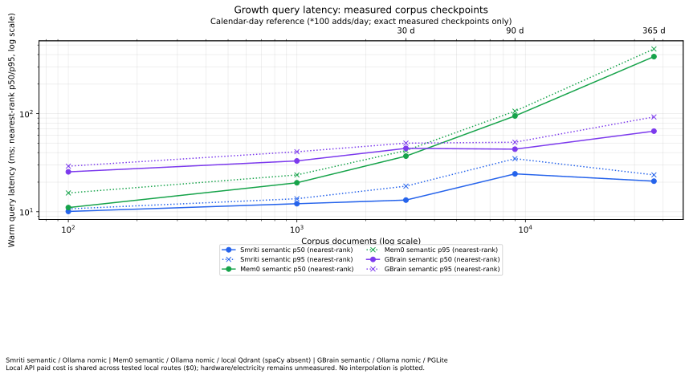

<p align="center">
  
</p>

<h1 align="center">SMRITI <sub>स्मृति</sub></h1>

<p align="center"><b>Structured Memory with Reflective Indexing and Temporal Inference</b><br>
<i>smriti</i> (स्मृति): Sanskrit for "that which is remembered."</p>

<p align="center">
  <a href="LICENSE"></a>
  
  
  
  
  
  <a href="https://github.com/vn-envy/Smriti/pulls"></a>
</p>

<p align="center">
  <a href="https://vn-envy.github.io/Smriti/"><b>Explore the four retrieval streams</b></a>
</p>

The core is a zero-infrastructure, local-first, Apache-2.0 memory layer for AI agents. It uses one SQLite file: no Neo4j, Postgres, Docker, cloud account, or paid tier is required. Stdlib HTTP + numpy is the core dependency surface. The optional enterprise package adds governance metadata and can write a separate audit sink or verified pack.

**Jump to:** [PR #2 highlights](#pr-2--where-smriti-stands) · [Since v0.3.2](#what-changed-since-v032) · [Benchmarks](#benchmarks) · [Architecture](#architecture) · [Install](#install--try-it-in-60-seconds) · [MCP](#drop-it-into-your-agent-mcp) · [Roadmap](#roadmap) · [Release notes](RELEASE_NOTES.md)

## PR #2 — where Smriti stands

**Local agent memory that preserves what changed—and lets you inspect the evidence.**

The [PR #2 candidate](https://github.com/vn-envy/Smriti/pull/2) combines explicit
fact history, project-scoped applicability, four retrieval channels and a
portable SQLite core. It now has completed local growth comparisons and matched
selected-question QA runs, with raw evidence available for review.

| Measured highlight | Current result | What it means |
|---|---|---|
| **Warm retrieval at 36,500 records** | **20.5ms Smriti · 66.3ms GBrain semantic · 381.3ms Mem0 OSS** | Local synthetic workload, same nomic model; retrieval only |
| **Store footprint at that checkpoint** | **161.1MB Smriti · 840.2MB GBrain semantic · 313.8MB Mem0 OSS** | Measured store sizes, excluding shared model caches |
| **Matched answer quality** | **LongMemEval-S50: 64% / 64%; LoCoMo50: 54% / 52%** (Smriti / Mem0) | Competitive in these selected samples; no demonstrated quality superiority |
| **Held-out20 source-session recall@5** | **93.3% opt-in diverse Smriti · 87.9% GBrain · 84.6% default Smriti** | Retrieval ablation, not an answer-accuracy score |
| **Installed candidate validation** | **276 core + enterprise tests passed; clean dependency checks** | Non-editable wheels tested outside the checkout; separate Python 3.9/3.12 CI |

The strongest evidence is a small local footprint, low warm-retrieval latency
in the measured growth workload, and explicit, inspectable temporal history.
The next quality gains need better preservation of complete source statements,
selection of competing updates and more reliable judging. Larger graph,
reflection, hosting and connector surfaces remain strengths to learn from in
other systems. [Full tables and limits ↓](#benchmarks) ·
[Source-linked competitive review](audit/2026-09-05/COMPETITIVE-RESEARCH.md)

This is an **unreleased PR candidate**, compared with main snapshot `a2afb3d`
(core v0.3.2 / enterprise v0.1.0). Package version metadata is unchanged; no new
PyPI release or tag is implied. [Release notes and upgrade guidance](RELEASE_NOTES.md).

```python
from smriti import Smriti, LLM, OllamaEmbedder

mem = Smriti(path="memory.db",
             embedder=OllamaEmbedder("nomic-embed-text"),
             llm=LLM("qwen3:14b", provider="ollama"))

mem.add([{"role": "user", "content": "I live in Hyderabad."}],
        timestamp="2026-01-15T10:00:00Z")
mem.add([{"role": "user", "content": "I moved to Bengaluru on June 1st."}],
        timestamp="2026-06-02T10:00:00Z")

print(mem.context("where do I live?"))
# Illustrative output; extraction wording depends on the configured model.
# KNOWN FACTS:
# - [2026-01-15 | SUPERSEDED on 2026-06-01] The user lives in Hyderabad.
# - [2026-06-01 | CURRENT] The user lives in Bengaluru.
```

## What changed since v0.3.2

| Area | Previous main snapshot | PR #2 candidate |
|---|---|---|
| Applicability | Fact identity had no explicit applicability scope | Scope follows facts through consolidation, retrieval, MCP, receipts and JSON v3; project-specific values can remain separate |
| Temporal correctness | Existing history model with defects found during installation/audit | Late-arriving facts rebuild validity chains; enterprise world/known-time boundaries and retained history have regression coverage |
| Extraction | Model output needed stronger validation and failure visibility | Bounded source-grounded scope checks, at most one correction call, raw-episode preservation and explicit diagnostics |
| Operational reliability | Existing transactional/session and identity behavior needed edge-case hardening | Atomic direct writes, cross-connection cache refresh, embedding-identity checks, read-only doctor and tested legacy-pack compatibility |
| Retrieval experimentation | Existing profiles and four-channel fusion | Opt-in session diversity with bounded overfetch; ordinary defaults preserved |
| Evidence | Historical oracle/profile experiments and scale probes | Matched QA samples, five growth checkpoints, cost scenarios, GBrain/Hindsight/Graphify install evidence and independent artifact reviews |

These are verified implementation and evidence improvements. **We have not run
a matched old-v0.3.2 versus current-v7 answer-quality or speed experiment**, so
the new competitor results must not be advertised as a measured version-to-version
performance lift. The prior 85-test core changelog count and current 276-test
combined installed suite also cover different scopes.

## What you get

A memory layer you can run today, on your own machine, and verify on your own data — no infrastructure, no cloud account, no leaderboard to take on faith. The measurements below link to their tested configurations and limits.

**1. One line to run. Nothing to stand up.** `pip install -e .` gives you a working core memory layer in a single SQLite file — no Postgres, Neo4j, Qdrant, Redis, Docker, or cloud account. The dependency surface is the Python standard library plus numpy. The offline core suite and quickstart run with no network and no API keys; lite mode is fully offline.

**2. No external services to break — and clear failure boundaries.** Memory is one file: no cluster to keep alive or version-match. It is provider-agnostic — point it at any OpenAI-compatible endpoint (Ollama, DeepSeek, Groq, OpenAI, vLLM…) and any embedder. Direct writes and session ingestion are transactional, identical session replays can be deduplicated, malformed extraction output is diagnosed, and LLM attempt/usage metadata is exposed for inspection.

**3. Cost follows the mode and provider.** Lite mode does zero LLM calls at write time. Full mode makes an extraction call per session and may make additional calls for semantic arbitration, bounded scope correction and provider retries. Provider pricing, model output, retries, and workload determine the bill, so we do not publish a fixed per-question dollar claim. Apache-2.0 includes the graph, temporal, and retrieval-profile features; there is no paid core tier.

**4. A measured local scale envelope, with a clear boundary.** The matched 768-dimensional growth run measured **20.474ms warm p50 retrieval at 36,500 records** with a **161.075MB** store. The full comparison, p95, ingestion times and workload qualifications are [below](#speed-and-storage-as-memory-grows). The vector channel uses an exact numpy scan; multi-million-row, high-concurrency serving remains a future evaluation target. Supersession preserves prior facts and their validity metadata for current and historical queries.

**5. Small enough to inspect, honest enough to verify yourself.** The benchmark harness ships with it, so you measure SMRITI on *your* data, with *your* judge, on *your* hardware — `bench/ab.sh` runs a fixed-judge A/B and prints the delta. The audit records the exact configurations and open limits instead of turning a small diagnostic into a leaderboard claim.

## Agile retrieval (*drishti*)

One store, many ways of looking at it. Four retrieval channels — lexical, semantic, entity, temporal — are individually switchable, and **retrieval profiles** bundle them into named, per-query policies. Ask for facts when you want facts; ask for relationships when you want the graph; go deep when you want everything.

| Profile | What it does | Reach for it when |
|---|---|---|
| `facts` | current-state precision: lexical + semantic + 1-hop entity; validity-annotated, CURRENT-facts-first packing; no summaries | "where do I live?", knowledge updates |
| `relations` | 2-hop *sambandha* traversal + semantic entity linking, entity channels up-weighted | "who works with Rachel?", connections |
| `timeline` | *kala*-boosted: date-anchored episodes, chronological evidence, as-of semantics | "what happened in March?", before/after |
| `deep` | all channels + key expansion + observation digests + enumerate-don't-assert packing | counts, totals, "summarize everything" |
| `auto` | zero-token router picks one of the above | agents that don't want to choose |

```python
mem.search("who mentors Rachel?", profile="relations")
mem.context("how many concerts did I attend?", profile="deep")
mem.search("db migration steps", channels={"lexical"})   # BM25 only — skips the embedding entirely
mem.search("what changed in June?", channels={"kala", "artha"})  # Sanskrit aliases accepted

# custom profiles are data, not code — benchmark yours with the shipped harness
from smriti import RetrievalProfile
support = RetrievalProfile(channels={"lexical", "semantic"}, k=8)
mem.search(query, profile=support)
```

> [!NOTE]
> Built-in profiles carry an `evidence` field linking to their historical within-system experiments. Those oracle A/B results use different models and workloads from the current comparisons below; they do not establish cross-system or version-to-version superiority. Use the shipped harness to evaluate a profile on your own workload.

The same selection is exposed to agents through the MCP tools (`profile` and `channels` on `recall`/`search`), so an agent spends one enum per call instead of seven numeric knobs.

## Architecture





Supersession preserves prior facts and their bi-temporal history; explicit owner erasure is a separate operation. History carries validity metadata (validity window = *avadhi* अवधि), so one store answers both "what's true now" and "what was true then."

Facts may also carry an explicit applicability `scope`, such as
`project:Atlas`. An empty scope is the legacy unscoped value. Only explicitly
single-valued predicates such as `primary_programming_language` and
`preferred_theme` replace an older value within the same subject, predicate,
and scope; generic `prefers` facts remain multi-valued. Scope is persisted and
included in retrieval evidence, MCP structured results, exports, and enterprise
packs. Export format v3 preserves it; v1/v2 imports remain supported under
their existing embedding-identity checks.

Model-generated scopes pass a bounded lexical check against the source turns
and returned fact statement before embedding or storage. An invalid scope can
trigger at most one additional logical extraction call; unresolved candidates
are omitted from fact writes while the raw episode is retained. `add()` and the
MCP `remember` tool expose the retry outcome and counts, while detailed
diagnostics remain available on `last_extraction_diagnostics`. This guard is
source-grounded lexical evidence, not semantic proof of identity, quotation,
or clause boundaries. Direct `add_fact()` calls remain trusted explicit writes.

Two design decisions worth defending:

1. **Facts AND raw episodes are both first-class at retrieval time.** Extraction-only systems lose whatever the extractor missed; episode-only systems fumble knowledge updates. Fusing both gets the precision of consolidated facts with the recall safety net of raw evidence.
2. **Supersession, not mutation.** "Where do I live?" reads CURRENT facts. "Where did I live before March?" reads the validity windows. Same store, zero extra machinery, full audit trail.

### Modes

- **`lite`** (alias `laghu`, लघु — "light") — no LLM at write time at all. Episodic ingest + 4-channel hybrid retrieval. Fully offline-capable and useful when write-time cost or model access is constrained.
- **`full`** (alias `purna`, पूर्ण — "complete") — adds fact extraction + write-time consolidation. It makes one extraction call per session in the ordinary path, with additional calls possible for semantic arbitration, bounded scope correction and provider retries. Full-mode quality depends on the configured model and predicate normalization.

## Ancient wisdom, load-bearing

SMRITI's vocabulary isn't branding sprinkled on top. Indian epistemology worked out a precise technical language for memory two millennia before vector databases, and the pipeline maps onto it almost one-to-one. Each borrowed term earned its place because the classical meaning *is* the engineering meaning:

- **anubhava → samskara → smriti** (Nyaya): direct experience leaves impressions; recollection arises from impressions. That *is* the write path — and it encodes a design argument: memory is **derived** from experience but is not the experience itself, which is why SMRITI retrieves over both facts (precision) and raw episodes (recall safety net).
- **badha** (बाध, Vedanta — *sublation*): a later cognition invalidates an earlier one **without erasing that it occurred** — as when the rope is seen and the snake is sublated. That is supersession, precisely: `invalid_at` is set, `superseded_by` points forward, history stays queryable. Correction is an event in time, not an overwrite.
- **sangama** (संगम — *confluence*): four rivers meeting. Four retrieval channels, one Reciprocal-Rank-Fusion ranking.
- **drishti** (दृष्टि — *way of seeing*): the same store admits many valid views. Retrieval profiles make each view explicit, named, and testable.
- **mauna** (मौन — *deliberate silence*): knowing when not to answer. Abstention is scored in the harness, not treated as failure.

The rules that keep this honest (full lexicon and reasoning: [`NOMENCLATURE.md`](NOMENCLATURE.md)): **code stays English** (`valid_from`, `retrieve`, `--mode lite` — the two exceptions are the `laghu`/`purna` mode aliases and the channel aliases `shabda`/`artha`/`sambandha`/`kala`); **docs lead with the concept and gloss with the term**; and **no forced poetry** — if a future component has no honest Sanskrit fit, it gets an English name.

<details>
<summary><b>The lexicon at a glance</b> (click to expand)</summary>

| Term | Devanagari | Classical meaning | Maps to |
|---|---|---|---|
| smriti | स्मृति | that which is remembered | the system itself |
| anubhava | अनुभव | direct experience | episodic store (append-only) |
| grahana | ग्रहण | grasping, apprehension | fact extraction |
| samskara | संस्कार | impression left by experience | consolidated fact store |
| badha | बाध | sublation | supersession — invalidate, never delete |
| avadhi | अवधि | term, duration | validity window `[valid_from, invalid_at)` |
| padartha | पदार्थ | entity, category | entity table (graph-lite links) |
| smarana | स्मरण | the act of recollection | retrieval |
| shabda / artha / sambandha / kala | शब्द / अर्थ / सम्बन्ध / काल | word / meaning / relation / time | the four channels |
| sangama | संगम | confluence of rivers | RRF fusion |
| prasanga | प्रसंग | context, occasion | the packed context block |
| drishti | दृष्टि | way of seeing | retrieval profiles |
| laghu / purna | लघु / पूर्ण | light / complete | `lite` / `full` modes |
| pariksha | परीक्षा | examination | the benchmark harness |
| nyaya | न्याय | logic, right judgment | the LLM judge |
| mauna | मौन | deliberate silence | abstention |

</details>

## How it compares on what you'll actually run into

Every recent open framework made a bet, and each bet carries a real operational cost:

| Framework | Their strength | What Smriti should learn | Defensible distinction |
|---|---|---|---|
| **GBrain** | Typed graph, synthesis and gap analysis, with a local PGLite default and optional Postgres deployments | Operational doctor surfaces, degraded-mode reporting, and query-level evidence | A smaller Python/SQLite kernel focused on inspectable temporal fact history rather than a broad personal/company brain |
| **Graphify** | Deterministic local AST graphs for code, with explicit versus inferred edges | Preserve source locations and make code graphs an optional evidence source | Conversational temporal memory is a different job from code structure |
| **Mem0** | Mature extraction pipeline, broad SDK, managed platform, and multiple local storage options | Mature integrations and fixed-budget, same-judge comparisons | Explicit validity intervals and inspectable history are the focus here; no cross-system superiority is established |
| **Hindsight** | Retain/recall/reflect, observations and Knowledge Pages, with embedded or server deployment | Session synthesis, stale-view refresh, and evidence-delivery checks | A smaller kernel with customer-visible history and optional evidence controls |

SMRITI's position is narrower: preserve explicit temporal history and provenance in a portable SQLite core, while leaving broader graph, synthesis, hosting, and connector surfaces to systems designed for them. Validity windows are printed into the context the model sees, and the comparison harness stays available for workload-specific verification.

### Bring your own benchmark

SMRITI's stance is **ship-and-verify**. The harness lets you measure on your own conversations, with the model and judge you actually use. Within-system oracle A/B evidence reports a +10.3-point multi-session lift for the per-type router (McNemar p=0.046) with no knowledge-update regression in that run; it is not a cross-system result and should be checked on your workload.

## Install & try it in 60 seconds

To evaluate these **unmerged PR #2 changes**, clone with
`git clone --branch codex/smriti-hardening-benchmarks-teaser https://github.com/vn-envy/Smriti`.
The ordinary command below checks out the default branch.

```bash
git clone https://github.com/vn-envy/Smriti && cd Smriti
python -m pip install -e '.[dev]' # install the core and test tools from source
python -m pytest tests/ -q    # core tests — no network, no API keys
python examples/quickstart.py # see supersession live
```

> [!WARNING]
> The package metadata uses **`smriti-agents`** (the `smriti-memory` name belongs to an unrelated project). No PyPI release was verified for this snapshot, so install from the repository as above. The import name is `smriti`.

The quickstart runs fully **offline** using `MockLLM` to demonstrate full-mode extraction and supersession. For real LLM-backed extraction, point SMRITI at any OpenAI-compatible endpoint (Ollama, vLLM, LM Studio, Groq, DeepSeek, OpenRouter, hosted) and any embedder — nothing else to install.

For an existing database, `smriti-doctor --db memory.db` performs read-only SQLite integrity, schema, count, WAL, and embedding-dimension checks. The command reports whether embedder identity is tracked, legacy-untracked, or empty-untracked.

SMRITI records the embedder identity in each new database and rejects a reopen with an incompatible model, endpoint, or dimension. Databases created before this metadata existed require a one-time explicit `Smriti(..., adopt_legacy_embedder=True)` after you verify that the configured embedder matches the one originally used. For MCP-managed databases, use `smriti-mcp --adopt-legacy-embedder --db memory.db` for that one-time adoption.

Core `export_json()` / `import_json()` is lossless for the core schema, including embeddings and supersession chains. Enterprise governance metadata is outside that format: use `enterprise_mem.snapshot(path)` for a consistent database backup, or `enterprise_mem.build_pack(path, name=...)` followed by `verify_pack()` / `open_pack()` for a checksummed, optionally signed, read-only knowledge pack. Do not use core JSON export as an enterprise governance backup.

### Drop it into your agent (MCP)

SMRITI ships a one-command MCP server, so any MCP-compatible agent (Claude Code, Cursor, …) gets persistent, auditable memory:

```bash
smriti-mcp --db memory.db        # or: python -m smriti.mcp_server --db memory.db
```

Add it to your agent's MCP config:

```json
{ "mcpServers": { "smriti": { "command": "smriti-mcp", "args": ["--db", "memory.db"] } } }
```

It exposes six typed tools returning structured JSON — `remember`, `recall`, `search`, `facts_about`, `add_fact`, `stats`. The read tools take `profile` (`facts` / `relations` / `timeline` / `deep` / `auto`) and `channels` arguments, so agents shape retrieval per call. Offline by default (no key); set `SMRITI_LLM_MODEL` / `SMRITI_LLM_PROVIDER` / `SMRITI_API_KEY` for full extraction mode.

### Benchmark it on *your* data

Don't take our word for it — run the included harness on your own conversations, with your own judge:

```bash
bash bench/ab.sh   # fixed-judge A/B, prints the accuracy delta
```

## Benchmarks

**Measured through September 8, 2026.** These are self-run, independently checked
within this project, selected-workload results—not an external certification or
vendor leaderboard. We ran real installed packages and retained configurations,
raw per-question outputs, failures, model identities and dataset hashes.

### Answer quality: matched reader and judge

Both systems received the same selected questions and complete per-question
haystacks under the same chunk/context budgets. The frozen installed-v4 Smriti
candidate (lite mode) and local Mem0 OSS (`infer=False`, Qdrant) used
`qwen3:8b` for the reader/judge and `nomic-embed-text:v1.5` embeddings. These scores
precede the latest installed-v7 hardening; they are not a measured v7 quality lift.
Budgets: k=12, 16,000 characters/session, 1,000/chunk, 9,000 in reader context,
256 answer tokens and 8 judge tokens; thinking disabled. Abstention rows use
the harness's abstention heuristic rather than the answerable-question judge.

| Selected test | Smriti | Mem0 OSS | What the result supports |
|---|---:|---:|---|
| LongMemEval-S50: all questions | **32/50 · 64%** | **32/50 · 64%** | Equal recorded score in this sample |
| ↳ Answerable questions | 14/30 · 46.7% | 14/30 · 46.7% | Substantial room to improve evidence delivery and reading |
| ↳ Abstention questions | 18/20 · 90% | 18/20 · 90% | Same recorded abstention performance |
| LoCoMo50: all questions | **27/50 · 54%** | **26/50 · 52%** | One-question difference; no demonstrated superiority |
| ↳ Answerable questions | 21/40 · 52.5% | 20/40 · 50% | Exploratory difference |
| ↳ Abstention questions | 6/10 · 60% | 6/10 · 60% | Same recorded abstention performance |
| Operational / cleanup failures, each test | 0 / 0 | 0 / 0 | Both completed all 50 rows in each run |

LongMemEval-S50 contains 40% abstention questions, so its overall score does not
represent the full 500-question dataset. LoCoMo's exploratory paired bootstrap
for the score difference spans **−6 to +10 percentage points**; questions share
conversations, and that dependence is not modeled by this interval. Known judge
errors are retained and documented. Full-history describes the selected
questions' haystacks, not completion of every question in either dataset.

Evidence: [LongMemEval pair and configuration review](audit/2026-09-05/raw/longmemeval-pair-final-independent-review.json),
[LoCoMo pair review](audit/2026-09-05/raw/locomo-pair-final-independent-review.json),
[exact-source disagreement review](audit/2026-09-05/raw/longmemeval-pair-four-disagreement-review.json).
No matched generated-answer score was measured for GBrain, Hindsight or Graphify.

### Retrieval: keep each workload separate

| Test / configuration | Source-session recall@5 | Reciprocal rank | Completed |
|---|---:|---:|---:|
| LongMemEval-S retrieval50 · Smriti | 0.8383 | 0.8300 | 48/50 |
| LongMemEval-S retrieval50 · Mem0 OSS | 0.8300 | 0.8333 | 48/50 |
| Held-out20 · Smriti default | 0.8458 | 0.8875 | 20/20 |
| Held-out20 · Smriti opt-in session diversity | **0.9333** | 0.9042 | 20/20 |
| Held-out20 · GBrain semantic | 0.8792 | **0.9083** | 20/20 |

The first pair uses the same 50 selected IDs, dataset, nomic model and budgets;
its denominator includes two failures per adapter. Its nine-question
multi-session stratum was **0.6111 Smriti / 0.7407 Mem0**, which motivated the
separate diversity experiment. The held-out20 comparison uses the same 991
sessions and 10,047 input chunks, nomic 768-dimensional vectors and a five-chunk
budget. Its reciprocal rank uses **deduplicated session order within those
chunks**, not conventional chunk rank. GBrain's run verified full vector
coverage and no degraded search; expansion, reranking and graph enrichment were
not the evaluated route. Do not compare values across the two workloads as if
they were a single ranking.

```python
# Opt-in experiment; ordinary search/context defaults stay unchanged.
mem.search(query, k=5, session_diverse=True, session_overfetch=3)
mem.context(query, k=5, session_diverse=True, session_overfetch=3)
```

Iterative retrieval/context currently reject this option. More session coverage
is a promising retrieval result, not proof of better generated answers.
Evidence: [retrieval50 paired analysis](audit/2026-09-05/public-retrieval-s50-paired-analysis.md),
[held-out20 independent review](audit/2026-09-05/raw/gbrain-heldout20-independent-review.json).

### Speed and storage as memory grows

**At 36,500 synthetic records, Smriti's warm retrieval p50 was 20.474ms**, versus
66.268ms for GBrain semantic and 381.298ms for local Mem0 OSS in these runs.

| Records | Smriti semantic p50 | GBrain semantic p50 | Mem0 OSS semantic p50 | GBrain lexical p50¹ |
|---:|---:|---:|---:|---:|
| 100 | 10.062ms | 25.486ms | 11.015ms | 2.861ms |
| 1,000 | 12.059ms | 32.935ms | 19.714ms | 3.411ms |
| 3,000 | 13.135ms | 44.231ms | 36.861ms | 5.266ms |
| 9,000 | 24.310ms | 43.396ms | 94.669ms | 12.220ms |
| **36,500** | **20.474ms** | **66.268ms** | **381.298ms** | **39.022ms** |



| At 36,500 records | Smriti semantic | GBrain semantic | Mem0 OSS semantic | GBrain lexical¹ |
|---|---:|---:|---:|---:|
| Warm p95 | 23.726ms | 92.448ms | 456.301ms | 47.373ms |
| Store footprint² | 161.075MB | 840.246MB | 313.803MB | 206.529MB |
| Cumulative ingestion | 693.925s | 1,060.756s | 686.973s | 235.371s |
| Observed paid model/API charges | $0 | $0 | $0 | $0 |

Apple M5, 24GB RAM; 20 warm queries over five synthetic topics per checkpoint;
nearest-rank p50/p95. The semantic routes share local Ollama
`nomic-embed-text:v1.5`, measured at 768 dimensions. Smriti uses lite ingestion;
Mem0 uses local Qdrant with `infer=False`; GBrain uses persistent PGLite hybrid
search with maintenance. Optional Mem0 spaCy models were unavailable: original
query text was used without entity boosts. All 100 timed queries per semantic
track returned topic-relevant hits. This easy synthetic relevance check is not
an answer-quality benchmark.

¹ GBrain lexical is a separate no-embedding, `ANALYZE`-maintained configuration;
it is faster at the first four checkpoints and is not semantic parity. Its
0.820s cumulative maintenance is recorded separately. An untuned 5,000-document
GBrain lexical run reached 1,516.268ms p50; that query-plan observation must not
be merged into the maintained series.

² Footprints use each implementation's measured store boundary, including the
reported database/WAL or storage-directory files; shared model caches are
excluded. See the raw reports for boundaries. Hardware cost is not included.

These are warm retrieval timings, not end-to-end answer speed. Cold rows have
different boundaries (Smriti/Mem0 client reopens versus GBrain worker restarts),
so we do not present a matched cold-start ranking. Ingestion here does not test
full-mode extraction cost. The uncontrolled elapsed times from the separate
answer/judge runs are also excluded from speed comparisons.

### Cost over time

At **100 additions/day**, the measured 3,000 / 9,000 / 36,500-record checkpoints
represent **30 / 90 / 365 days of workload volume**. They were not collected over
a year, and the non-monotonic timing samples do not predict production latency.
All tested local growth routes incurred **$0 paid model/API charges**. That is
shared by Smriti, Mem0 and GBrain; electricity, hardware, hosting and operator
time remain unmeasured, so there is no defensible total-cost winner yet.

For budgeting a different deployment, our **September 7, 2026 managed-Mem0
pricing snapshot** modeled 100 adds/day and the following retrieval volumes:

| Retrievals/day | 30-day modeled subscription | 90-day | 365-day | Snapshot tier |
|---:|---:|---:|---:|---|
| 20 | $0 | $0 | $0 | Hobby |
| 100 | $19 | $57 | $228 | Starter |
| 1,000 | $249 | $747 | $2,988 | Pro |
| 2,000 | Quote required | Quote required | Quote required | Custom / usage quote |

This is a dated subscription scenario using the report's billing assumptions,
not a bill we paid or a benchmark of managed Mem0. Recheck current plan limits
before buying. Full checkpoint tables, cumulative ingestion, resubmission,
cold boundaries, storage, source snapshots and calculations:
[cost and speed report](audit/2026-09-05/cost-speed-projections.md),
[validated semantic results](audit/2026-09-05/growth-semantic-final-report.json),
[validated matched/lexical results](audit/2026-09-05/growth-matched-final-report.json).

### Other tested systems and installed-model checks

| System / track | What we actually ran | Observed result | Comparison limit |
|---|---|---|---|
| **Hindsight 0.9.2** | Embedded installation, then 20 retains / 12 recalls | All operations and cleanup passed; expected sources appeared in the first five results for 10/10 answerable queries; relevant source ranked first for 9/10 | Every query returned all 20 facts, including both unanswerable queries. No generated-answer scoring; observations/reranking disabled; bank embedding model not exposed |
| **Graphify 0.9.54** | Real install and AST extraction over 13 Smriti core files | 229 nodes, 531 edges, source-linked query verified; extraction reported zero LLM tokens | Code-structure tooling, not the same conversational-memory workload; no matched quality/cost/speed score |
| **Smriti installed-v7 full mode** | Fresh local-model Mira contract and Leila/Omar generalization | 26/26 and 8/8 bounded checks; corrected as-of probe verifies Sketch → Figma while retaining history | Single-model fixtures, not broad semantic accuracy; inferred applicability still has limits |
| **Mem0 OSS full extraction** | Two bounded Mira installation/update probes | Current and historical evidence returned in the inspected examples | Separate smoke tests; the paired QA/growth route above uses `infer=False` |

For Hindsight's current-drink question, old coffee ranked first and new tea
second. Both unanswerable recalls were nonempty; without an answer stage, that
is not evidence of hallucination. Its earlier three-retain/two-recall smoke
remains available separately.

Evidence: [Hindsight full comparative run](audit/2026-09-05/hindsight-comparative-v1.json)
and [independent review](audit/2026-09-05/raw/hindsight-comparative-independent-review.json),
[Graphify install](audit/2026-09-05/raw/graphify-installed-smoke.json),
[Smriti installed-model verification](audit/2026-09-05/VERIFIED-RESULTS.md),
[Mem0 extraction probe](audit/2026-09-05/mem0-mira-full-installed.json).

### Earlier diagnostics and reproduction

Earlier runs remain available to expose how the evaluation improved:

| Earlier track | Coverage | How to use it |
|---|---|---|
| Mixed-config diagnostic | 20 documents / 12 queries; recall@5 Smriti .85, Mem0 1.00, GBrain .95 | Different embeddings/configurations; smoke evidence, not a ranking |
| LongMemEval oracle retrieval | Smriti 500 questions; Mem0 10-question pilot | Evidence-only retrieval ceiling; extraction and answer generation bypassed |
| Matched answer/judge preflight | Six questions; Smriti 4/6, Mem0 3/6 | Harness check, superseded by the larger selected QA runs above |
| Historical oracle profile A/B and 256-dim scale probe | Different models, budgets and workloads | Within-system historical observations; not a before/after measure of PR #2 |

Start with the [benchmark methodology](audit/2026-09-05/benchmark-methodology.md),
[verified result index](audit/2026-09-05/VERIFIED-RESULTS.md),
[reproduction script](audit/2026-09-05/benchmark-reproduce.sh),
[paired retrieval reproduction](audit/2026-09-05/reproduce-public-retrieval-s50-paired.py)
and runners in [`bench/`](bench/). [BENCHMARKS.md](BENCHMARKS.md) preserves older
within-system experiments. The JSON artifacts record exact datasets, model
budgets, engine revisions and candidate hashes; use those settings to reproduce
a reported number rather than treating an arbitrary default run as identical.

```bash
python -m bench.download --all
python -m bench.qa_comparison --help
python -m bench.public_retrieval --help
python -m bench.public_retrieval_gbrain_semantic --help
python -m bench.growth --help
python -m bench.hindsight_probe --help
```

## Repo layout

```
smriti/             core library
  store.py          SQLite bi-temporal store — anubhava + samskara (FTS5 + vectors)
  extraction.py     grahana: single-pass session → atomic facts
  consolidation.py  badha: ADD / SUPERSEDE / SKIP conflict resolution
  retrieval.py      smarana: 4-channel retrieval + sangama (RRF) + prasanga packing
  profiles.py       drishti: named, evidence-carrying retrieval profiles + v2 router
  memory.py         public Smriti API (modes: lite/laghu, full/purna)
  embedder.py       Ollama / OpenAI-compatible / offline hash
  llm.py            OpenAI-compatible client + mock
  mcp_server.py     stdlib-only MCP server (6 typed tools, stdio JSON-RPC)
bench/              pariksha: LongMemEval + LoCoMo runners, nyaya judge, CLI, A/B
tests/              core offline test suite (mock LLM, hash embedder)
examples/           runnable quickstart
NOMENCLATURE.md     the full lexicon and why each term is load-bearing
enterprise/         optional enterprise modules (separate package, zero core edits):
                    tri-temporal as-of queries · exact lineage · evidence receipts
                    · retention/legal holds · deployment profiles · verified
                    knowledge packs · multi-store federation. See enterprise/README.md
site/               landing-page source
```

## Roadmap

### Delivered in PR #2 — verified September 8, 2026

- [x] Temporal, applicability-scope, extraction and enterprise hardening; 276 installed core/enterprise tests and clean `pip check`.
- [x] Bounded actual-model checks: Mira 26/26, Leila/Omar 8/8, independently verified current/as-of tool history.
- [x] Paired LongMemEval-S50 and LoCoMo50 answer/judge runs, retrieval50, GBrain held-out20 and Hindsight/Graphify installation probes.
- [x] Five growth checkpoints through 36,500 records, three semantic routes plus maintained lexical GBrain, and explicit cost-over-volume scenarios.
- [x] Thirty-second teaser plus original and camera-motion 60-second social films, with reproduction source and [verification](audit/2026-09-05/social-film-verification.md).

### Next priorities, driven by the failures we inspected

1. **Preserve complete supporting source messages.** Measure whether the actual user statement survives retrieval and context truncation; session-header presence is insufficient. Evaluate session diversity on a new held-out selection.
2. **Make competing updates explicit to the reader.** Preserve dates, source order and complete values, and distinguish current answers from explicit as-of requests.
3. **Improve judge/date reliability.** Keep raw judge outputs, flag ambiguous gold and date disagreements, and preserve historical scores rather than silently relabeling them.
4. **Broaden quality and scale evaluation.** Repeat across representative models and larger held-out sets; measure concurrent and higher-dimensional workloads before choosing ANN/quantization or larger graph/reflection features.

See the [prioritized quality plan and acceptance criteria](audit/2026-09-05/QUALITY-NEXT-STEPS.md)
and [full build roadmap](audit/2026-09-05/ROADMAP.md). These are future priorities,
not capabilities already demonstrated by the current scores.

### The boundary (how we avoid becoming a 50k-line platform)

The core stays small and auditable; everything else is a replaceable module:

```
core (must stay readable in a sitting)      optional modules (replaceable)
├── episodes (anubhava)                     ├── LLM extraction (any OpenAI-compatible)
├── bi-temporal facts (samskara/badha)      ├── reranking (any .rerank())
├── entity links + aliases (padartha)       ├── observations/reflection (opt-in)
├── 4-channel hybrid retrieval (smarana)    ├── MCP server (stdlib, read/write only)
├── profiles (drishti)                      └── future: remote server/auth,
├── provenance, erasure, export                  multi-agent coordination
└── one SQLite file
```

Reflection, graph traversal beyond 2 hops, dashboards, auth services, and multi-tenant machinery belong *outside* the core — that's the line that keeps SMRITI forkable, auditable, and cheap.

## Contributing

Issues and PRs welcome. The bar for merging a retrieval change is the same bar we hold ourselves to: run `bash bench/ab.sh` (or the offline test suite for non-retrieval changes) and post the delta. Evidence over vibes.

## License

Apache 2.0. Everything. No gated tiers — the temporal model, the entity graph, the retrieval profiles, and the benchmark harness are the product.

## Citation

```bibtex
@software{smriti2026,
  title  = {SMRITI: Structured Memory with Reflective Indexing and Temporal Inference},
  year   = {2026},
  url    = {https://github.com/vn-envy/Smriti},
  note   = {Zero-infrastructure, local-first, bi-temporal memory layer for AI agents}
}
```
