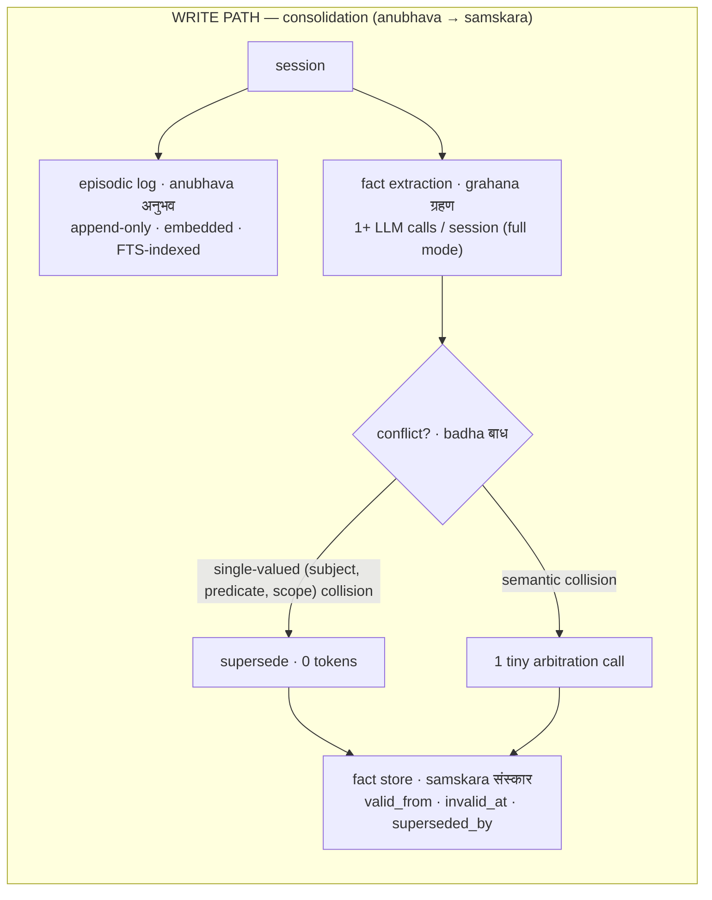
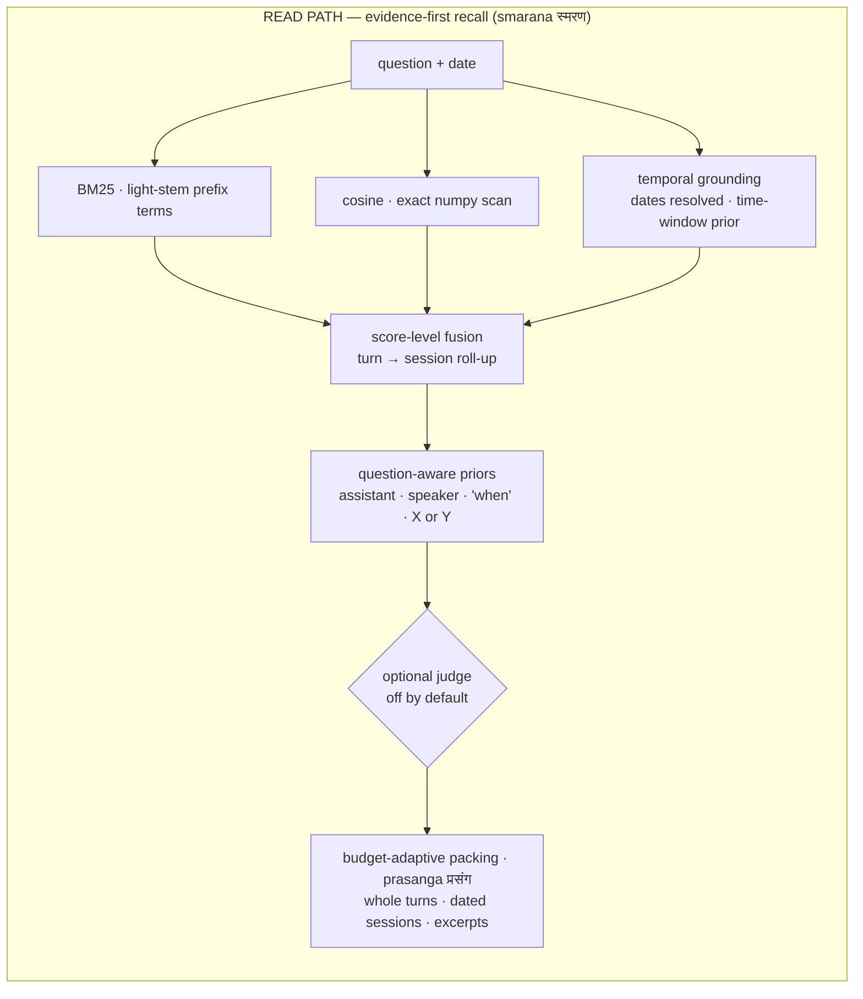

<p align="center">
  
</p>

<h1 align="center">SMRITI <sub>स्मृति</sub></h1>

<p align="center"><b>Structured Memory with Reflective Indexing and Temporal Inference</b><br>
<i>smriti</i> (स्मृति): Sanskrit for "that which is remembered."</p>

<p align="center">
  <a href="LICENSE"></a>
  
  
  
  
  
  <a href="https://github.com/vn-envy/Smriti/pulls"></a>
</p>

<p align="center">
  <a href="https://vn-envy.github.io/Smriti/"><b>Explore the retrieval streams</b></a> ·
  <a href="RELEASE_NOTES.md"><b>Release notes</b></a>
</p>

Smriti is a memory layer for AI agents that runs on your machine, in one
SQLite file. No Postgres, Neo4j, Docker, cloud account or paid tier; the core
depends on the Python standard library and numpy. It remembers what changed
and when, and at question time it hands the model whole, dated evidence
instead of fragments. Apache-2.0, everything included. An optional enterprise
package adds audit receipts, retention, legal holds and verified packs.

**Jump to:** [Why Smriti](#why-smriti) · [What's new in 0.4](#whats-new-in-04) · [Quickstart](#quickstart) · [How it works](#how-it-works) · [Results](#results) · [Optional judges](#optional-a-relevance-judge) · [MCP](#use-it-from-your-agent-mcp) · [Roadmap](#roadmap)

## Why Smriti

- **One file, nothing to run.** `pip install` and point it at a path. Memory
  is a single SQLite file you can copy, back up or delete. Lite mode makes no
  LLM calls at all.
- **The right evidence reaches the model.** The default read engine keeps
  whole turns, resolves relative dates and groups evidence by session. On
  held-out LongMemEval questions, 87.6% of evidence turns reach the context
  complete, against 43.2% for the 0.3.x path and 69.1% for Mem0 OSS on the
  same turns.
- **Memory that knows when.** A changed fact supersedes the old one without
  deleting it. Validity windows are printed into the context, so "where do I
  live?" and "where did I live in March?" both work from the same store.
- **Plugs into agents.** A one-command MCP server gives Claude Code, Cursor
  and other MCP clients persistent memory with six typed tools.
- **Verify it yourself.** The benchmark harness ships with the code, and every
  number in this README links to its method, raw results and limits.

## What's new in 0.4

| Release | What you get |
|---|---|
| **0.4.0** · evidence-first recall | New default read engine: score-level BM25 + vector fusion, question-aware priors, inline dates and budget-adaptive packing. Blinded answer accuracy on held-out LME-X 47.5% → 70.4%. |
| **0.4.1** · sharper evidence | The assistant's own replies rank lower: +4.7 points of evidence at 3,000 characters and +5.4 at 9,000, with no model involved. |
| **0.4.2** · judge trials finished | Four public rounds testing Jev, Laya and CLM-8B as relevance judges, a `rank` mode for contrastive judges, and guidance on when a judge is worth turning on. No default change. |

Full details and upgrade notes: [RELEASE_NOTES.md](RELEASE_NOTES.md).

## Quickstart

```bash
git clone https://github.com/vn-envy/Smriti && cd Smriti
python -m pip install -e '.[dev,onnx]'   # core + test tools + in-process ONNX embeddings
python -m pytest tests/ -q               # offline: no network, no API keys
python examples/quickstart.py            # supersession, live
```

> [!NOTE]
> The package name is **`smriti-agents`** (`smriti-memory` is an unrelated
> project) and the import name is `smriti`. There is no PyPI release yet, so
> install from the repository.

**Evidence with dates**, fully offline with an in-process embedder (any folder
holding `model.onnx` and `tokenizer.json`, such as the ONNX export of
`sentence-transformers/all-MiniLM-L6-v2`):

```python
from smriti import Smriti, OnnxEmbedder

mem = Smriti(path="memory.db", embedder=OnnxEmbedder("models/all-MiniLM-L6-v2"))
mem.add([{"role": "user", "content": "I went to a support group yesterday."}],
        timestamp="2023-05-08T13:56:00Z", session_id="s1")
print(mem.context("When did I go to the support group?", now="2023-07-01"))
# (Current date: 2023-07-01 Sat)
# CONVERSATION EVIDENCE (grouped by session, oldest first; ...):
# [Session 2023-05-08 Mon]
#   user: I went to a support group yesterday [2023-05-07].
```

**Facts that change over time**, with LLM extraction through any
OpenAI-compatible endpoint (Ollama, vLLM, LM Studio, Groq, DeepSeek,
OpenRouter or hosted):

```python
from smriti import Smriti, LLM, OllamaEmbedder

mem = Smriti(path="memory.db",
             embedder=OllamaEmbedder("nomic-embed-text"),
             llm=LLM("qwen3:14b", provider="ollama"))
mem.add([{"role": "user", "content": "I live in Hyderabad."}], timestamp="2026-01-15T10:00:00Z")
mem.add([{"role": "user", "content": "I moved to Bengaluru on June 1st."}], timestamp="2026-06-02T10:00:00Z")
print(mem.context("where do I live?"))
# Illustrative output; extraction wording depends on the model.
# KNOWN FACTS (validity window; CURRENT = still true, SUPERSEDED = true then, later changed):
# - [2026-06-01 | CURRENT] The user lives in Bengaluru.
# - [2026-01-15 | SUPERSEDED on 2026-06-01] The user lives in Hyderabad.
```

<details>
<summary><b>Operating an existing store</b></summary>

- `smriti-doctor --db memory.db` runs read-only integrity, schema, count, WAL
  and embedding-dimension checks, and reports whether the embedder identity
  is tracked.
- Smriti records the embedder identity in each new database and refuses to
  reopen it with an incompatible model, endpoint or dimension. For a database
  created before this metadata existed, pass `adopt_legacy_embedder=True` once
  (or `smriti-mcp --adopt-legacy-embedder`) after checking the embedder
  matches.
- `export_json()` / `import_json()` round-trip the core schema, including
  embeddings and supersession chains. For enterprise stores use
  `snapshot()`, or `build_pack()` with `verify_pack()` / `open_pack()`.

</details>

## How it works

### Write path: experience becomes impressions



Every turn is kept as an episode. In full mode, facts are extracted and
consolidated: a collision on a single-valued `(subject, predicate, scope)`
supersedes the old fact for zero tokens, and only semantic collisions pay one
small arbitration call. Nothing is overwritten; owner erasure is a separate
operation.

- **`lite`** (alias `laghu`): no LLM at write time. Episodic ingest and hybrid
  retrieval, fully offline.
- **`full`** (alias `purna`): adds fact extraction and consolidation, usually
  one call per session, plus occasional arbitration, bounded scope correction
  and provider retries.

Facts may carry an applicability `scope` such as `project:Atlas`, so
project-specific values stay separate. Model-generated scopes are checked
against the source turns; an invalid scope triggers at most one correction
call, and the raw episode is always retained.

### Read path: evidence-first recall (default)



- **Score-level hybrid fusion.** BM25 and exact cosine are fused by score, not
  rank, and turn scores roll up to their sessions.
- **Question-aware priors.** The assistant's own replies rank lower unless the
  question asks what the assistant said; there are named-speaker and "when"
  priors, and "X or Y first?" questions are split into sub-queries.
- **Dates everywhere.** Relative dates resolve inline (`yesterday
  [2023-05-07]`), the question's time window becomes a soft prior, and
  sessions carry dated headers.
- **Budget-adaptive packing.** Whole turns are kept while they fit, with
  query-focused excerpts instead of prefix cuts, grouped by session in
  chronological order.

It is local and deterministic, and makes no LLM calls at query time.
`Smriti(read_engine="fusion")` keeps the 0.3.x read path: four channels
(lexical, semantic, entity, temporal) fused by reciprocal rank, with validity
annotation.

### Retrieval profiles (*drishti*)

One store, several ways of looking at it. Profiles are named, per-query
policies; the MCP tools expose them as a single enum.

| Profile | What it does | Reach for it when |
|---|---|---|
| `evidence` (default) | evidence-first recall, described above | most questions about past conversations |
| `facts` | current-state precision: validity-annotated, CURRENT-first facts | "where do I live?", knowledge updates |
| `relations` | 2-hop entity traversal with semantic entity linking | "who works with Rachel?" |
| `timeline` | date-anchored episodes in chronological order, as-of semantics | "what happened in March?" |
| `deep` | all channels, key expansion and observation digests | counts, totals, "summarise everything" |
| `auto` | a zero-token router picks one of the above | agents that don't want to choose |

```python
mem.search("who mentors Rachel?", profile="relations")
mem.context("how many concerts did I attend?", profile="deep")
mem.search("db migration steps", channels={"lexical"})   # BM25 only, no embedding

from smriti import RetrievalProfile                    # custom profiles are data, not code
support = RetrievalProfile(channels={"lexical", "semantic"}, k=8)
mem.search(query, profile=support)
```

## Results

All figures are self-run on held-out splits with raw per-question results in
the repository. LME-X is the LongMemEval questions with 48 cross-question
distractor sessions each; it is **not** the official LongMemEval-S haystack,
and none of these numbers is comparable with published leaderboard scores.

### Evidence-first recall (0.4.0)

| Held-out test split | Smriti 0.3.x path | **Smriti evidence-first** | Mem0 OSS 2.2.0, same turns |
|---|---:|---:|---:|
| Evidence turns complete in context: LoCoMo | 55.9% | **84.7%** | 79.4% |
| Evidence turns complete in context: LME-X | 43.2% | **87.6%** | 69.1% |
| Blinded answer accuracy: LoCoMo, 200 questions × 2 reads | 46.0% | **65.5%** | 62.7% |
| Blinded answer accuracy: LME-X, 120 questions × 2 reads | 47.5% | **70.4%** | 61.7% |
| Search + context p50 on the lab datasets | 4–8 ms | 10–15 ms | 60–91 ms |
| Search p50 at 100,000 stored turns (synthetic) | 131.6 ms | **32.2 ms** | not measured |

Against Mem0 the difference is **+8.8 points on LME-X** (bootstrap 95% CI
+1.7 to +15.4, sign test p = 0.07) and a **statistical tie on LoCoMo** (+2.8,
CI −1.8 to +7.2). Against the 0.3.x path it is +19.5 and +22.9 points
(p < 0.0001). Every system received the same turns, timestamps, MiniLM vectors
and 9,000-character budget, and was scored by the same blinded reader (Claude
Haiku) and strict judge (Claude Sonnet); Mem0 ran with `infer=False` over the
verbatim turns. [Lab report, method and null results](audit/2026-09-25/LAB-REPORT.md) ·
[2025–2026 research survey](audit/2026-09-25/RESEARCH-SURVEY.md)

### Assistant replies ranked lower (0.4.1)

| Held-out LME-X questions (232) | 0.4.0 | **0.4.1** | Questions better / worse |
|---|---:|---:|---:|
| Evidence complete in context, 1,500 characters | 64.8% | 65.6% | 5 / 1 (not significant) |
| Evidence complete in context, 3,000 characters | 78.5% | **83.2%** | 23 / 1 |
| Evidence complete in context, 9,000 characters | 87.6% | **93.0%** | 26 / 0 |

The change came from reading a trained relevance judge's weights: its largest
weight said the assistant's own replies are rarely the evidence. LoCoMo, which
has no assistant turns, is unchanged.

### Decision-model judges (0.4.2)

Each judge re-ranks Smriti's top 20 memories on held-out LME-X, with settings
fixed on dev before the test.

| Judge | Right memory first | Evidence at 1,500 chars | Evidence at 3,000 chars | Cost | Memories leave the machine |
|---|---:|---:|---:|---|---|
| Smriti alone | 63.8% | 65.6% | 83.2% | $0 | No |
| + hosted Jev (35% blend) | 72.5% | **74.8%** | **86.5%** | $0.37 per 1,000 questions | Yes |
| + trained Laya head (local GPU) | **74.2%** | 72.6% | 86.0% | $0 | No |
| + CLM-8B (65% blend) | 27.1% | 68.6% | 82.6% | $0 | No |
| Perfect judge (ceiling) | 100% | 87.1% | 91.3% | – | – |

Hosted Jev helps out of the box. A small head trained on our labels over the
official Laya encoder is a statistical tie with Jev and keeps everything
local, but needs a GPU to be fast. CLM-8B as released does not beat Smriti's
own ranking. At 9,000 characters no judge helps. [Experiment record](audit/2026-09-25/decision-models/NOTES.md) ·
[X article](audit/2026-09-25/decision-models/x-article/x-article.md)

<details>
<summary><b>Earlier comparisons on the 0.3.x read path</b> (September 2026: growth, footprint, matched QA)</summary>

These were measured before the evidence-first engine, with real installed
packages, retained configurations, raw per-question outputs and dataset hashes.

| At 36,500 synthetic records (Apple M5, nomic 768-dim) | Smriti | GBrain semantic | Mem0 OSS |
|---|---:|---:|---:|
| Warm retrieval p50 | **20.5 ms** | 66.3 ms | 381.3 ms |
| Warm retrieval p95 | **23.7 ms** | 92.4 ms | 456.3 ms |
| Store footprint | **161.1 MB** | 840.2 MB | 313.8 MB |
| Paid model/API charges | $0 | $0 | $0 |

| Matched reader and judge (qwen3:8b), selected questions | Smriti | Mem0 OSS |
|---|---:|---:|
| LongMemEval-S50 | 32/50 · 64% | 32/50 · 64% |
| LoCoMo50 | 27/50 · 54% | 26/50 · 52% |

| Held-out20 retrieval, same 991 sessions | Source-session recall@5 |
|---|---:|
| Smriti with opt-in session diversity | **93.3%** |
| GBrain semantic | 87.9% |
| Smriti default (0.3.x) | 84.6% |

The QA samples show competitive, not superior, answer quality; the latency
figures are warm retrieval only, not end-to-end answer speed. Hindsight 0.9.2
and Graphify 0.9.54 were installed and probed but not scored on answers.
Full tables, cost-over-time scenarios and limits:
[benchmark methodology](audit/2026-09-05/benchmark-methodology.md),
[verified results](audit/2026-09-05/VERIFIED-RESULTS.md),
[cost and speed report](audit/2026-09-05/cost-speed-projections.md),
[competitive review](audit/2026-09-05/COMPETITIVE-RESEARCH.md).
Older within-system experiments are in [BENCHMARKS.md](BENCHMARKS.md).

</details>

### Reproduce it

```bash
python -m bench.lab.run --help            # LLM-free evidence benchmark (bench/lab/README.md)
python -m bench.lab.qa --help             # blinded reader/judge QA pipeline
bash bench/ab.sh                          # fixed-judge A/B on your own data
```

The GPU judges run from two Google Colab notebooks in
[`bench/lab/colab/`](bench/lab/colab/README.md).

## Optional: a relevance judge

Smriti's read path has no judge by default. If your context budget is tight,
you can add one: a "System One" decision model that answers "does this memory
help answer the question?" for each of Smriti's top candidates. Any endpoint
that speaks the TypeSafe `/v1/systemone` protocol works: hosted Jev, a local
`laya-serve`, or a `clm-serve` GPU host.

```python
import os
from smriti import Smriti, PROFILES
from smriti.decision import SystemOneReranker
from smriti.recall import RecallConfig

# Hosted Jev: every candidate memory is sent to api.typesafe.ai
jev = SystemOneReranker(api_key=os.environ["TYPESAFE_API_KEY"], price_per_mtok=0.042)
mem = Smriti(path="memory.db", reranker=jev)          # plus your embedder
judged = PROFILES["evidence"].with_overrides(
    recall=RecallConfig(rerank_depth=20, rerank_weight=0.35))   # the blend tested above
print(mem.context("When did I go to the support group?", profile=judged))
print(jev.stats.as_dict(), f"${jev.cost_usd:.4f}")
```

- `SystemOneReranker(base_url="http://127.0.0.1:8000", model=None)` points
  at a local `laya-serve`; nothing leaves the machine.
- Modes: `noul` (one yes/no question per memory, default), `fanout` (groups of
  memories per request), `choice`, and `rank` (the question as the
  instruction, for contrastive models such as CLM-8B).
- `LayaReranker` runs Laya in process when the optional `laya` package is
  installed.
- A reranker that defines `rerank_hits(query, hits)` also sees Smriti's
  score, rank and role for each candidate.
- Smriti Enterprise applies its egress checks to judge endpoints like any
  other remote adapter: the `local` profile allows loopback only.

## Use it from your agent (MCP)

```bash
smriti-mcp --db memory.db        # or: python -m smriti.mcp_server --db memory.db
```

```json
{ "mcpServers": { "smriti": { "command": "smriti-mcp", "args": ["--db", "memory.db"] } } }
```

Six typed tools return structured JSON: `remember`, `recall`, `search`,
`facts_about`, `add_fact` and `stats`. The read tools take `profile`,
`channels` and a `now` date (default today); with no profile they use the
evidence-first engine. The server is offline by default; set
`SMRITI_LLM_MODEL`, `SMRITI_LLM_PROVIDER` and `SMRITI_API_KEY` for full
extraction mode. `erase_*` operations are deliberately not exposed over MCP.

## Enterprise

[`enterprise/`](enterprise/README.md) is a separate package,
`smriti-enterprise`, with zero edits to the core: tri-temporal as-of queries,
exact lineage, evidence receipts bound to the packed-context digest, retention
and legal holds, deployment profiles with egress checks, verified knowledge
packs and multi-store federation. Version 0.2.0 works with core 0.4.0 to
0.4.2.

## How it compares

| Framework | Its strength | What Smriti learns from it | Where Smriti differs |
|---|---|---|---|
| **Mem0** | Mature extraction pipeline, broad SDK, managed platform | Integrations and fixed-budget, same-judge comparisons | Explicit validity intervals and inspectable history in one file |
| **GBrain** | Typed graph, synthesis and gap analysis on PGLite or Postgres | Doctor surfaces, degraded-mode reporting, query-level evidence | A smaller Python/SQLite kernel focused on temporal fact history |
| **Hindsight** | Retain / recall / reflect, observations, embedded or server deployment | Session synthesis and evidence-delivery checks | A smaller kernel with customer-visible history |
| **Graphify** | Deterministic local code graphs with explicit versus inferred edges | Source locations and optional code-graph evidence | Conversational temporal memory is a different job |

Smriti's position is deliberately narrow: explicit temporal history and
provenance in a portable SQLite core, with graph synthesis, hosting and
connectors left to systems designed for them.

## Ancient wisdom, load-bearing

The vocabulary is not decoration. Indian epistemology worked out a precise
language for memory long before vector databases, and the pipeline maps onto
it closely:

- **anubhava → samskara → smriti** (Nyaya): experience leaves impressions;
  recollection arises from impressions. That is the write path, and the reason
  Smriti retrieves over both facts (precision) and raw episodes (a recall
  safety net).
- **badha** (बाध, sublation): a later cognition invalidates an earlier one
  without erasing that it occurred. That is supersession: `invalid_at` is set,
  `superseded_by` points forward, history stays queryable.
- **sangama** (संगम, confluence): retrieval channels meeting in one ranking.
- **drishti** (दृष्टि, a way of seeing): one store, many valid views, each a
  named profile.
- **mauna** (मौन, deliberate silence): knowing when not to answer. Abstention
  is scored in the harness.

Code stays English, docs lead with the concept, and nothing gets a Sanskrit
name without an honest fit. Full lexicon: [`NOMENCLATURE.md`](NOMENCLATURE.md).

## Repo layout

```
smriti/             core library
  memory.py         public Smriti API (lite / full modes, read engines)
  recall.py         evidence-first read engine (default)
  temporal.py       deterministic date resolution and time-window priors
  retrieval.py      0.3.x four-channel retrieval, RRF fusion, context packing
  profiles.py       named retrieval profiles and the zero-token router
  store.py          SQLite bi-temporal store (episodes, facts, FTS5, vectors)
  extraction.py     session → atomic facts
  consolidation.py  ADD / SUPERSEDE / SKIP conflict resolution
  decision.py       optional System One judges (Jev, laya-serve, clm-serve, Laya)
  embedder.py       Ollama / OpenAI-compatible / offline hash embedders
  onnx_embedder.py  in-process ONNX embeddings (optional extra)
  llm.py            OpenAI-compatible client and mock
  mcp_server.py     stdlib-only MCP server (six typed tools)
  doctor.py         read-only store checks (smriti-doctor)
bench/              LongMemEval and LoCoMo runners, judge, CLI, A/B harness
  lab/              LLM-free evidence lab, blinded QA, judge trials, Colab notebooks
tests/              offline core test suite
enterprise/         optional governance package (separate install)
audit/              dated evidence: lab reports, raw results, reviews
examples/           runnable quickstart
site/               landing page source
```

## Roadmap

**Delivered in 0.4:** evidence-first recall as the default read engine,
in-process ONNX embeddings, the assistant-reply prior, optional System One
judges and a public four-round trial of Jev, Laya and CLM-8B.

**Next, driven by what the trials and lab showed:**

1. **Package the local judge.** Ship the trained Laya head as an optional
   extra for GPU users, and test a trained head over CLM-8B's cacheable memory
   embeddings.
2. **Measure answers, not only evidence.** Re-run blinded QA with the 0.4.1
   prior and with judges, and extend the judge trials to LoCoMo and the
   official LongMemEval-S haystack.
3. **Make competing updates explicit.** Keep dates, source order and complete
   values together, and separate current answers from as-of requests.
4. **Scale past 100,000 turns.** Evaluate quantised or approximate vector
   search once concurrent and higher-dimensional workloads are measured.

**The boundary.** The core stays small enough to read in a sitting; LLM
extraction, reranking, observations and the MCP server are replaceable
modules. Reflection, graph traversal beyond two hops, dashboards, auth and
multi-tenant machinery belong outside the core.

## Contributing

Issues and PRs are welcome. The bar for a retrieval change is the one we hold
ourselves to: run `bash bench/ab.sh` or the lab (`python -m bench.lab.run`) and
post the delta, including null results. Non-retrieval changes need the offline
test suite to pass.

## License

Apache-2.0. Everything: the temporal model, the entity graph, the retrieval
profiles and the benchmark harness.

## Citation

```bibtex
@software{smriti2026,
  title   = {SMRITI: Structured Memory with Reflective Indexing and Temporal Inference},
  year    = {2026},
  version = {0.4.2},
  url     = {https://github.com/vn-envy/Smriti},
  note    = {Zero-infrastructure, local-first, bi-temporal memory layer for AI agents}
}
```
