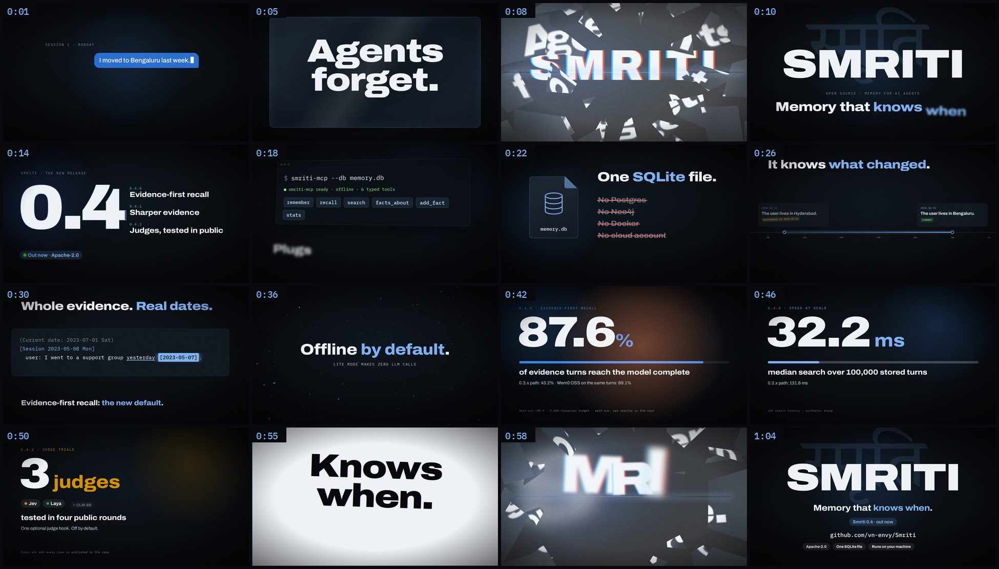

# Smriti 0.4 launch trailer (1:09)

A fast product trailer for the 0.4 release: 1920×1080, 60 fps, stereo.
It uses kinetic typography, whip pans, camera follows, directional motion
blur and glass-shatter reveals, cut to the beat of the funky music bed.



| Time | Beat | On screen |
|---|---|---|
| 0:00 | Cold open | Session 1: "I moved to Bengaluru last week." Session 2: "Where do I live now?" gets "Sorry, I don't know." |
| 0:04 | The problem | "Agents forget." on a glass pane. It cracks on the pickup, then shatters on the drop. |
| 0:08 | Title | SMRITI स्मृति · Memory that knows when. |
| 0:12 | The release | 0.4.0 evidence-first recall · 0.4.1 sharper evidence · 0.4.2 judges, tested in public. |
| 0:16 | MCP | `smriti-mcp --db memory.db` brings up six typed tools. |
| 0:20 | One file | One SQLite file. No Postgres, Neo4j, Docker or cloud account. Python stdlib + numpy. |
| 0:24 | Knows when | Hyderabad → Bengaluru: the old fact is superseded, never deleted. |
| 0:28 | Dated evidence | "yesterday" resolves to `[2023-05-07]` inside the packed context. |
| 0:32 | Breakdown | Runs on your machine · Offline by default · Apache-2.0, all of it. |
| 0:42 | The numbers | 87.6% · 70.4% · 32.2 ms · 93.0% · 3 judges · Enterprise |
| 0:54 | Recap | One file. Knows when. Evidence first. Open source. That last pane shatters. |
| 0:58 | End card | Logo, tagline, "Smriti 0.4 · out now", github.com/vn-envy/Smriti |

Every number comes from the README's results tables (held-out LME-X, self-run),
and each one carries its qualifier on screen:

| Figure | Source row |
|---|---|
| 87.6% | 0.4.0: evidence turns complete in context, LME-X. Was 43.2% on the 0.3.x path; Mem0 OSS scored 69.1% on the same turns. |
| 70.4% | 0.4.0: blinded answer accuracy, LME-X, 120 questions × 2 reads. Was 47.5%; Mem0 OSS scored 61.7%. |
| 32.2 ms | 0.4.0: search p50 at 100,000 stored turns (synthetic). Was 131.6 ms. |
| 93.0% | 0.4.1: evidence complete in context at 9,000 characters, 232 questions. Was 87.6%; 26 questions better, 0 worse. |
| 3 judges | 0.4.2: Jev, Laya and CLM-8B tested in four public rounds; an optional hook that is off by default. |

## How it is built

Same approach as the decision-model explainer in `audit/2026-09-25/decision-models/explainer-video/`:

- **Picture.** `trailer.html` is a deterministic page. `render(t)` sets every
  element for time `t`, so every frame is reproducible. Motion blur comes from
  each layer's velocity between `t − 1/60` and `t`, applied as a directional
  SVG blur. Glass shards are clip-path pieces of the pane, cracked along the
  same edges that then fly apart.
- **Sound.** `cues()` in the page lists every hit, whoosh, key press and pop on
  the picture timeline. `trailer_audio.py` does four things:
  - cuts the music on its own bar lines (120 BPM; the edit is in `assets-manifest.json`);
  - places the supplied glass, keyboard and UI-bubble recordings next to synthesised whooshes, risers and hits;
  - ducks the bed under the big hits;
  - masters to −14 LUFS with a −1.2 dBFS ceiling.

```bash
# fonts (OFL) into ./fonts: Archivo[wdth,wght].ttf, IBMPlexMono-Regular.ttf, IBMPlexMono-Medium.ttf,
#   TiroDevanagariSanskrit-Regular.ttf, all from github.com/google/fonts
# supplied audio into ./assets (names and hashes in assets-manifest.json), then:
ffmpeg -i assets/funky_launch.mp3 -ar 48000 -ac 2 assets/funky_launch.wav
node cues.js                        # cues.json from trailer.html
python trailer_audio.py             # audio.wav
node frames.js 0 4140 frames 60     # JPEG frames; split the range across processes
ffmpeg -framerate 60 -i frames/f%05d.jpg -i audio.wav -c:v libx264 -preset slow -crf 16 \
  -pix_fmt yuv420p -c:a aac -b:a 256k -movflags +faststart -shortest smriti-0.4-trailer.mp4
```

The rendered MP4s and the supplied media are not committed. `poster.jpg` is a
still from the end card.
